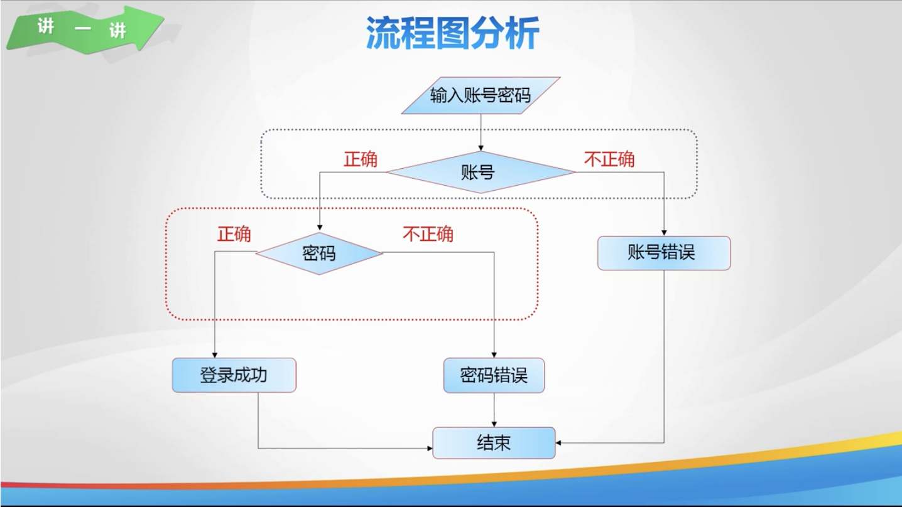

# Lesson 09

[toc]

## 1. 回到上一讲


## 2. 分支嵌套





## 3. 判断账号密码


## 4. 猜数游戏


## 5. 计算邮资


## 6. 欢乐秀一秀


## 7. 总结


## 8. 亲自出码: 能够被 3 和 5 整除


## 9. 代码

1. `day09.cpp`

   ```c++
   #include <iostream>
   
   using namespace std;
   
   int main() {
       // 判断账号密码
       // 声明变量, 存储注册时的账号密码, 输入的账号密码
       // int user = 123, pw = 456, u, p;
       // 使用分支嵌套进行判断
       // if (u == user) { // 账号正确
       //     判断密码
       //     if (p == pw) {
       //         cout << "登录成功";
       //     } else { // 密码错误
       //         cout << "密码错误";
       //     }
       // } else { // 账号错误
       //     cout << "账号错误";
       // }
   
       // 猜数字游戏
       // 声明整型变量, 输入
       // int num;
       // cin >> num;
       // 判断
       // if (num == 35) {
       //     cout << "猜对了";
       // } else { // num != 35
       //     if (num > 35) {
       //         cout << "猜大了";
       //     } else {
       //         cout << "猜小了";
       //     }
       // }
   
       // 计算邮资
       // 声明变量, 整型变量, 字符型变量, 输入
       // int m, money;
       // char n;
       // cin >> m >> n;
       // 判断, 计算邮资
       // if (m <= 1000) {
       //     money = 8;
       // } else { // 超过 1000g
       //     // 超过部分的重量是否被 500 整除
       //     if ((m - 1000) % 500 == 0) {
       //         money = 8 + (m - 1000) / 500 * 4;
       //     } else {
       //         money = 8 + (m - 1000) / 500 * 4 + 4;
       //     }
       // }
       // 判断是否加急
       // if (n == 'y') {
       //     money += 5;
       // }
       // 输出
       // cout << money << endl;
       // return 0;
   }
   
   ```

2. `亲自出码.cpp`

   ```
   ```

   