# Lesson 16

[toc]

## 1. 回到上一讲

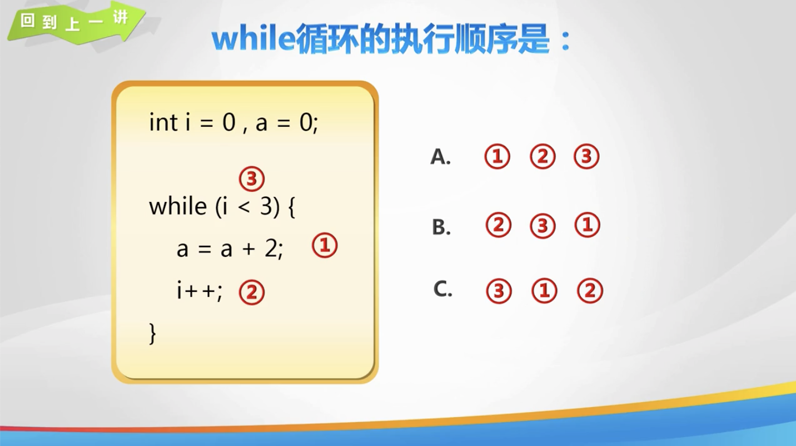

## 2. 计算机英语

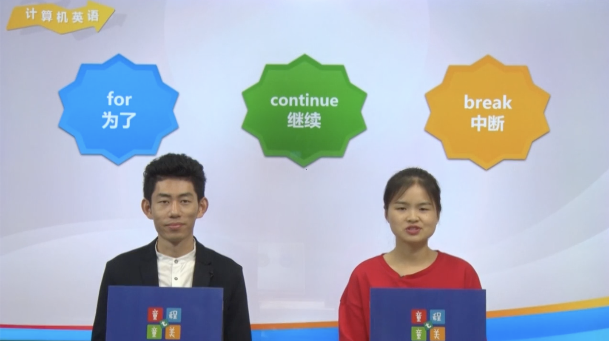

## 3. for 循环

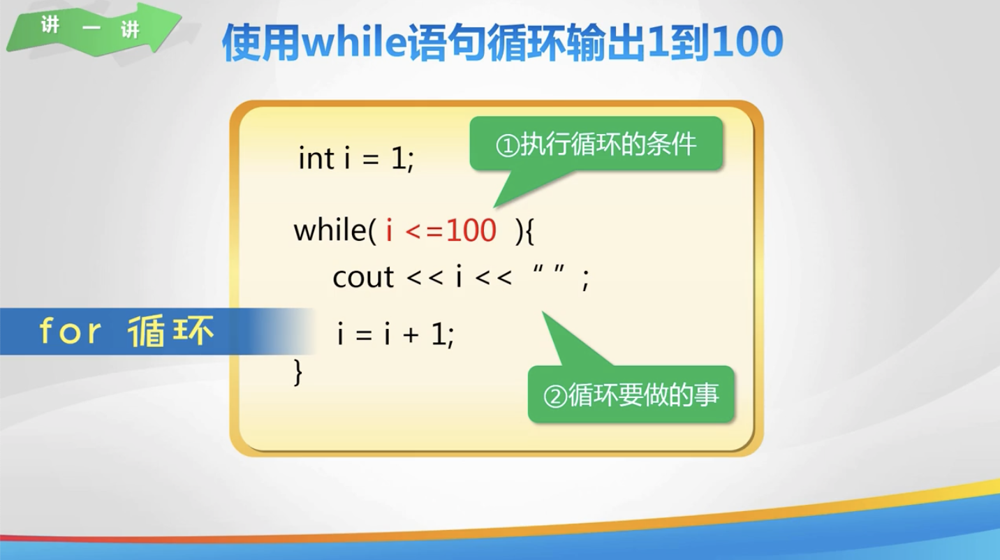

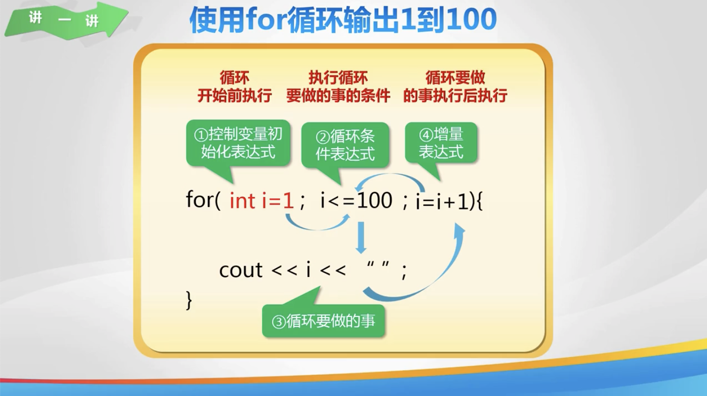

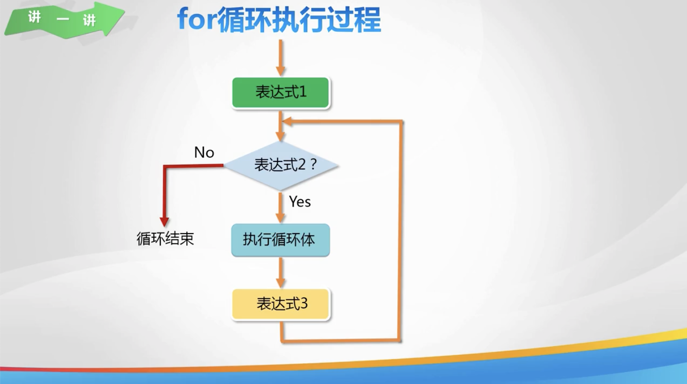

## 4. 输出 1-100 之间的单数

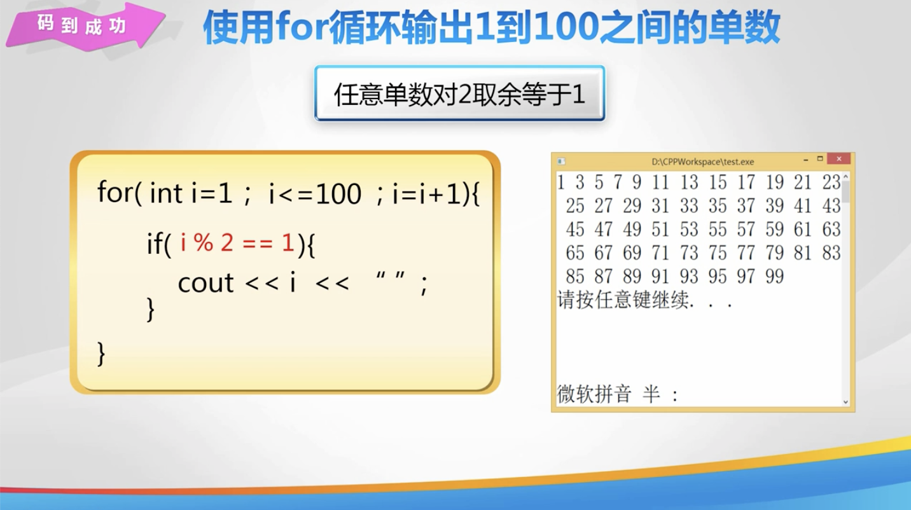

## 5. 奇数和偶数的和

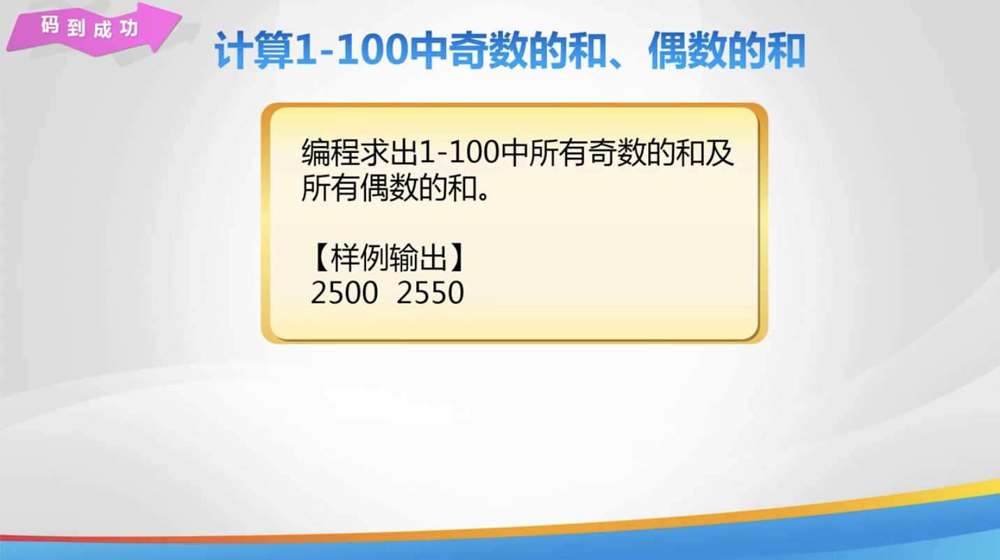

## 6. 求 n 个书中第二大的数

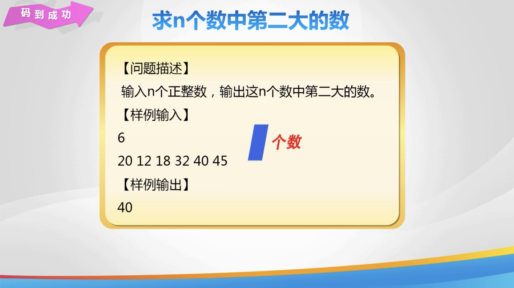

## 7. 练一练

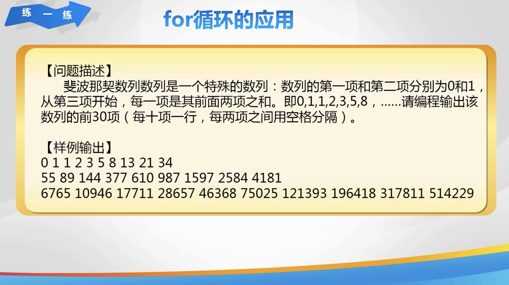

## 8. 秀一秀

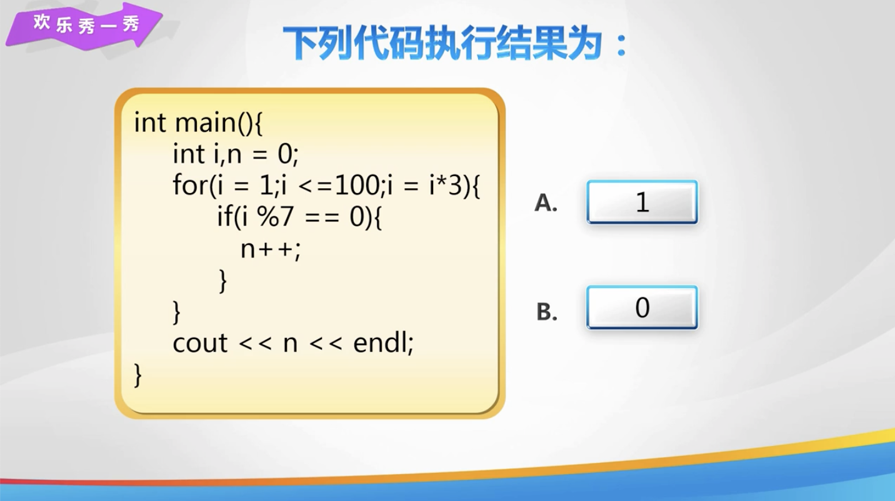

## 9. 总结


## 10. 亲自出码

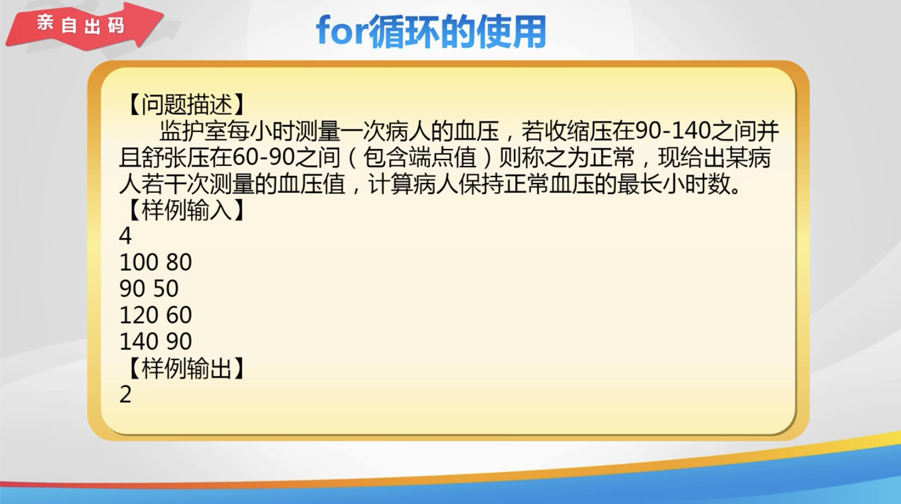

## 11. 代码

1. `day16.cpp`

   ```c++
   #include <iostream>
   
   using namespace std;
   
   int main() {
       // // 使用 for 循环输出 1 到 100
       // for (int i = 1; i <= 100; i = i + 1) {
       //     // 循环要做的事情
       //     cout << i << " ";
       // }
   
       // // 使用 for 循环输出 1 - 100 之间的单数
       // for (int i = 1; i <= 100; i = i + 2) {
       //     // 判断单数, 输出
       //     cout << i << " ";
       // }
   
       // // 计算 1 - 100 所有奇数的和, 偶数的和
       // // 声明变量
       // int sum1 = 0, sum2 = 0;
       // // for 循环枚举 100 个数, 判断求和
       // for (int i = 1; i <= 100; i++) {
       //     if (i % 2 != 0) { // 奇数
       //         sum1 += i;
       //     } else { // 偶数
       //         sum2 += i;
       //     }
       // }
       // // 输出奇数的和, 偶数的和
       // cout << sum1 << " " << sum2;
   
       // 求 n 个数当中第二大的数
       // 声明变量, 输出
       // int n;
       // cin >> n;
       // // for 循环输入
       // int temp;
       // int max1 = 0, max2 = 0;
       // for (int i = 0; i < n; i++) {
       //     cin >> temp;
       //     // 先看是否是最大
       //     if (temp > max1) {
       //         max2 = max1;
       //         max1 = temp;
       //     } else if (temp > max2) { // 是否为第二大
       //         max2 = temp;
       //     }
       // }
       // // 输出第二大的数
       // cout << max2 << endl;
   
       // 斐波那契数列
       // 声明变量存储前两个个数, 正在求的数
       // int first = 0, second = 1, current;
       // // 使用 for 循环遍历, 输出
       // for (int i = 1; i < 31; i++) {
       //     // 输出第 i 个数
       //     if (i == 1) {
       //         cout << 0 << " ";
       //     } else if (i == 2) {
       //         cout << 1 << " ";
       //     } else { // i >= 3
       //         current = first + second;
       //         // 更新前两个数的值
       //         first = second;
       //         second = current;
       //         cout << current << " ";
       //     }
       //     // 每输出 10 个换行
       //     if (i % 1 == 0) {
       //         cout << endl;
       //     }
       // }
   
       return 0;
   }
   ```

2. `亲自出码.cpp`

   ```c++
   #include <iostream>
   
   using namespace std;
   
   int main() {
       int n;
       cin >> n;
       // for 循环进行输入
       int t1, t2;
       int count = 0, max = 0; // count 正常压力持续小时, max 最长小时
       for (int i = 1; i <= n; i++) {
           cin >> t1 >> t2; // t1 收缩压, t2 舒张压
           // 判断是否正常
           if (t1 >= 90 && t1 <= 140 && t2 >= 60 && t2 <= 90) {
               count++;
               // 判断是否超过最大时长
               if (count > max) {
                   max = count;
               }
           } else { // 血压不正常
               count = 0;
           }
       }
       return 0;
   }
   ```

   