# Lesson 17

[toc]

## 1. 回到上一讲

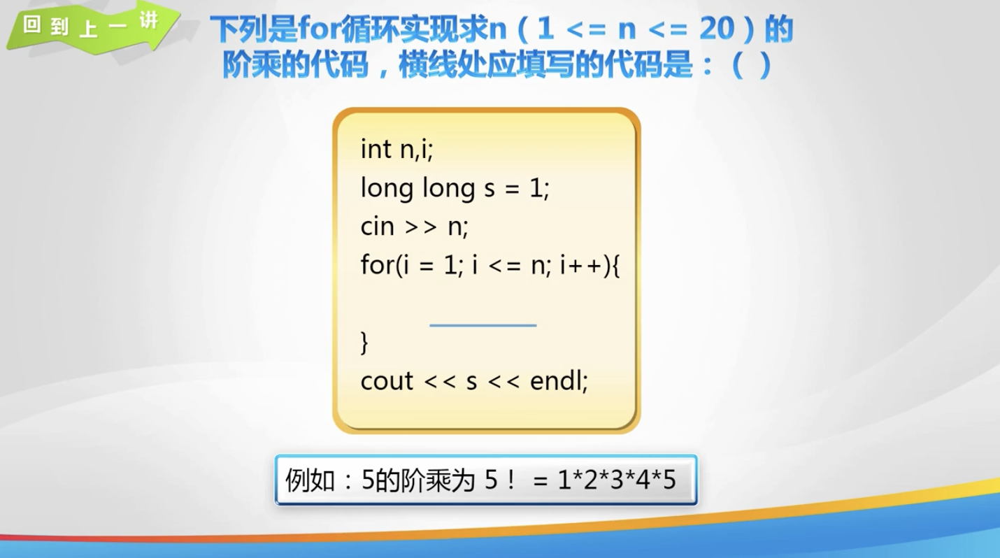

## 2. break 语句

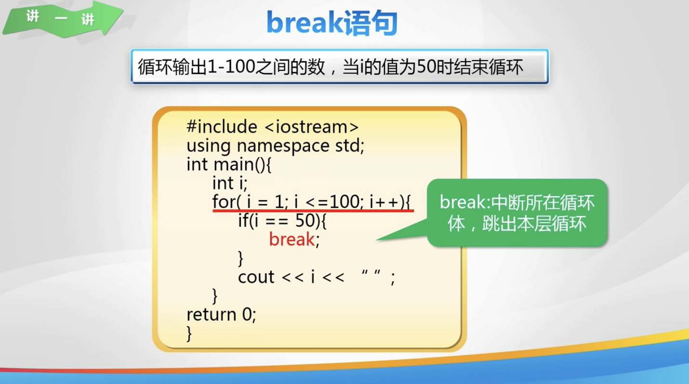

## 3. continue 语句

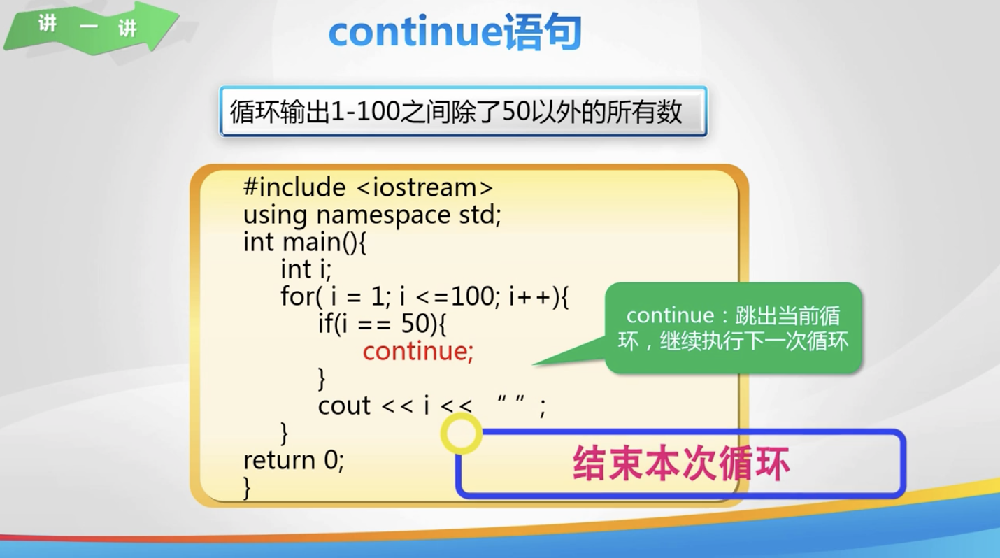

## 4. 判断质数

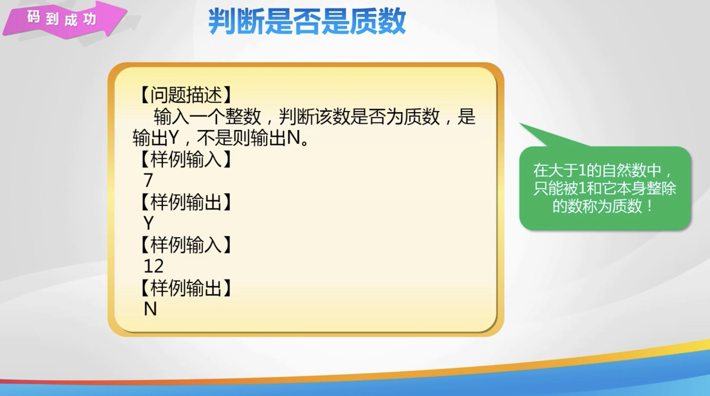

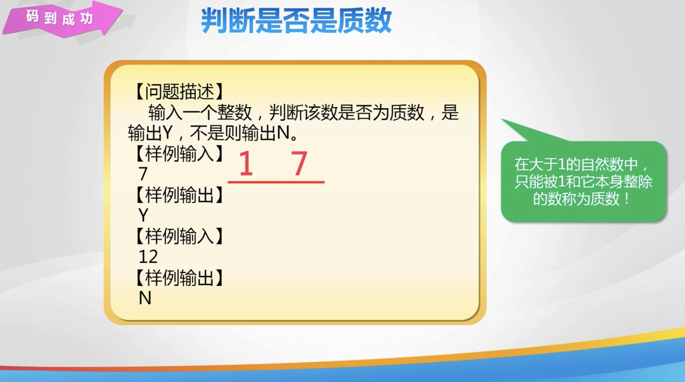

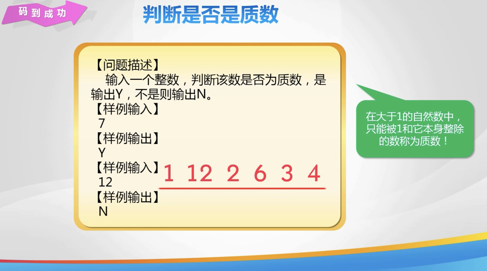

## 5. 质因数分解

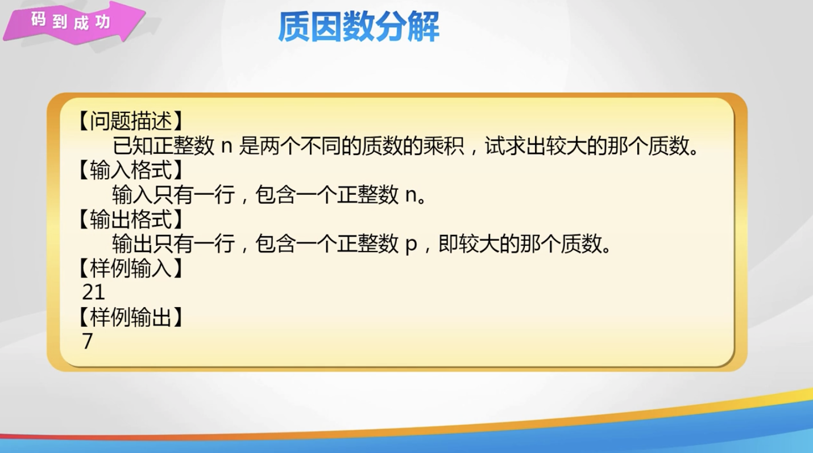

## 6. 形如 aabb 的数

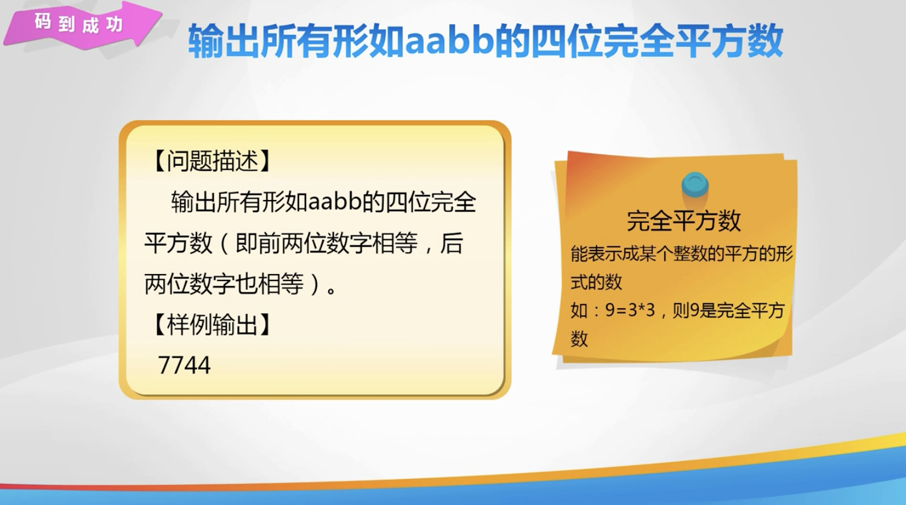

## 7. 练一练


## 8. 欢乐秀一秀

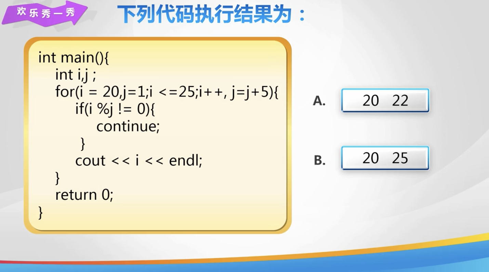

## 9. 总结

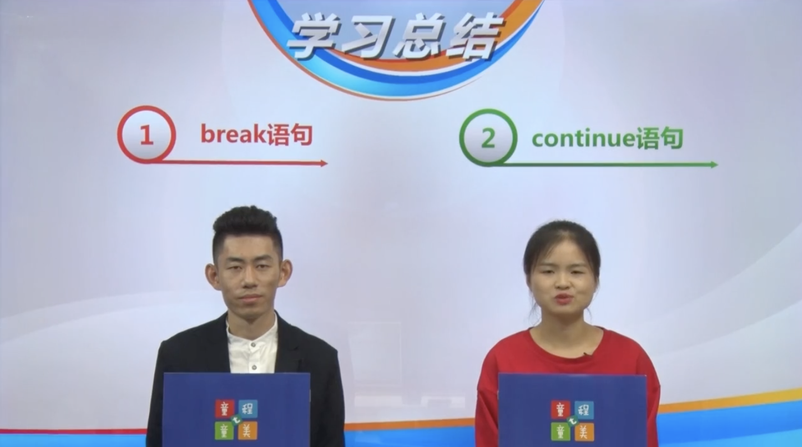

## 10. 亲自出码

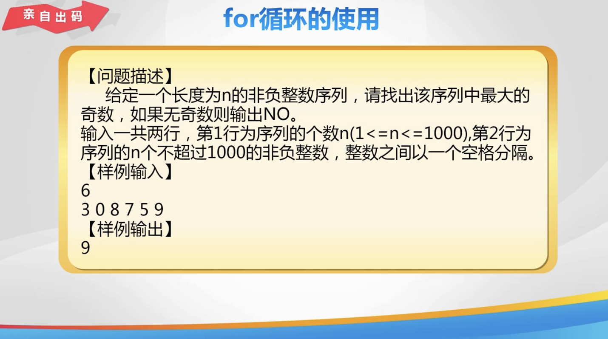

## 11. 代码

1. `da17.cpp`

   ```cpp
   #include  <iostream>
   
   using namespace std;
   
   int main() {
       // // break
       // int i;
       // for (int i = 1; i <= 100; i++) {
       //     // 判断, 使用 break 结束循环
       //     if (i == 50) {
       //         // 结束 for 循环
       //         break;
       //     }
       //     cout << i << " ";
       // }
   
       // // continue
       // int i;
       // for (int i = 1; i <= 100; i++) {
       //     if (i == 50) {
       //         // 跳过当前次循环
       //         continue;
       //     }
       //     cout << i << " ";
       // }
   
       // // 判断质数
       // int n;
       // cin >> n;
       // bool flag = true;
       // for (int i = 2; i < n; i++) {
       //     if (n % i == 0) {
       //         flag = false;
       //     }
       // }
       // // 根据 flag 标签, 输出 Y 或者 N
       // if (flag == true) {
       //     cout << "Y" << endl;
       // } else {
       //     cout << "N" << endl;
       // }
   
       // // 质因数分解
       // int n;
       // cin >> n;
       // // 找出较小质数, 输出较大的质数
       // for (int i = 2; i < n; i++) {
       //     if (n % i == 0) {
       //         cout << n / i;
       //         break;
       //     }
       // }
   
       // // 四位完全平方数
       // int n;
       // for (int i = 1;; i++) {
       //     n = i * i;
       //     if (n < 1000) {
       //         continue;
       //     }
       //     if (n > 9999) {
       //         break;
       //     }
       //     // 判断是否满足 aabb 的形式
       //     int high = n / 100;
       //     int low = n % 100;
       //     if (high % 11 == 0 && low % 11 == 0) {
       //         cout << n << endl;
       //     }
       // }
   
       // // 求 m 到 n 之间所有奇数的和
       // int m, n, sum = 0;
       // cin >> m >> n;
       // for (int i = m; i <= n; i++) {
       //     if (i % 2 == 0) {
       //         continue;
       //     }
       //     sum += i;
       // }
       // cout << sum << endl;
   
       return 0;
   }
   ```

2. `亲自出码.cpp`

   ```cpp
   #include  <iostream>
   
   using namespace std;
   
   int main() {
       int n, m, max = 0;
       cin >> n;
       for (int i = 1; i <= n; i++) {
           cin >> m;
           if (m % 2 == 0) {
               continue;
           }
           if (max < m) {
               max = m;
           }
       }
   
       if (max == 0) {
           cout << "NO" << endl;
       } else {
           cout << max << endl;
       }
   
       return 0;
   }
   ```