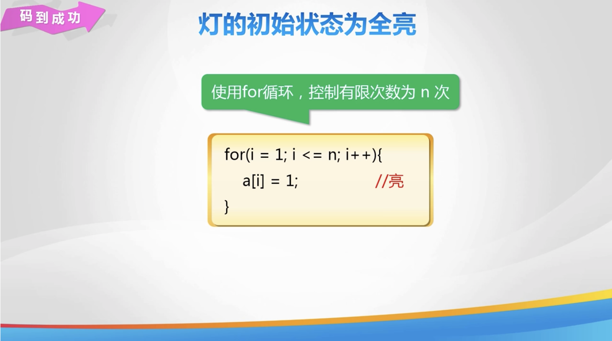

# Lesson 23

[toc]

## 1. 回到上一讲


## 2. 数列问题


## 3. 斐波那契数列


## 4. 状态模拟


## 5. 灯的开关问题





## 6. 练一练


## 7. 秀一秀


## 8. 总结


## 9. 亲自出码


## 10. 代码

1. `day22.cpp`

   ```cpp
   #include <iostream>
   
   using namespace std;
   
   int main() {
       // // 声明整形数组 arr, 存储 100 个元素
       // int arr[100];
       // // 声明字符型数组 ch, 存储 200 个元素
       // char ch[200];
   
       // // 通过数组下标获取数组元素的值
       // // int arr[5] = {1, 2, 3, 4, 5};
       // // int arr[5] = {};
       // int arr[5] = {1, 2};
       // // 获取元素的值
       // cout << arr[0] << endl;
       // cout << arr[1] << endl;
       // cout << arr[2] << endl;
       // cout << arr[3] << endl;
       // cout << arr[4] << endl;
   
       // int a[10] = {1, 2, 3, 4, 5, 6, 7, 8, 9, 10};
       // // 获取下标为 6 的元素的值
       // cout << a[6];
   
       // // 输出 n 个数中的最大值和最小值
       // int num[50];
       // int n;
       // cin >> n;
       // // 使用 for 循环 输入
       // for (int i = 0; i < n; i++) {
       //     cin >> num[i];
       // }
       // // 找最大值, 最小值
       // int max, min;
       // max = num[0];
       // min = num[0];
       // for (int j = 1; j < n; j++) {
       //     if (num[j] > max) {
       //         max = num[j];
       //     }
       //     if (num[j] < min) {
       //         min = num[j];
       //     }
       // }
       // // 输出
       // cout << max << " " << min << endl;
   
       return 0;
   }
   ```

2. `亲自出码.cpp`

   ```cpp
   #include <iostream>
   
   using namespace std;
   int arr[101];
   
   int main() {
       // 找比平均值大的数及对应下标
       int n;
       cin >> n;
       // 赋值
       int sum = 0;
       double avg = 0;
       for (int i = 0; i < n; i++) {
           cin >> arr[i];
           sum += arr[i];
       }
       avg = double(sum) / n;
       // 遍历数组元素, 输出平均值大的数, 及下标
       for (int j = 0; j < n; j++) {
           if (arr[j] > avg) {
               cout << arr[j] << " " << j << endl;
           }
       }
   }
   ```

   