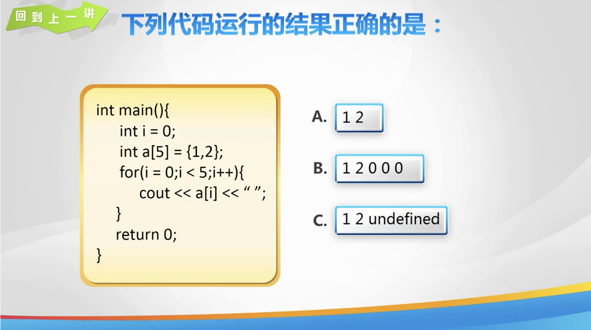
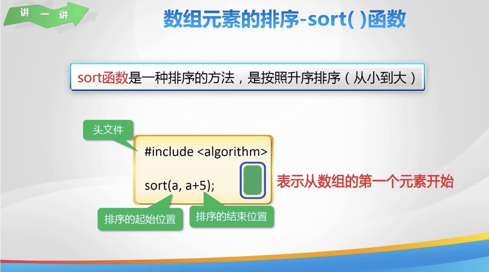
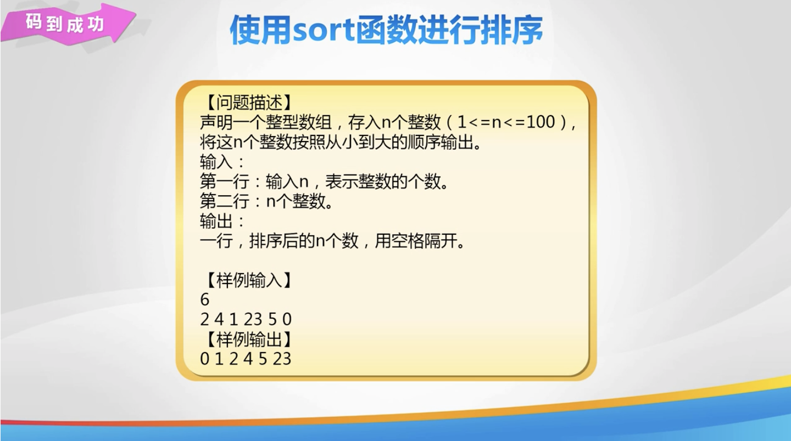
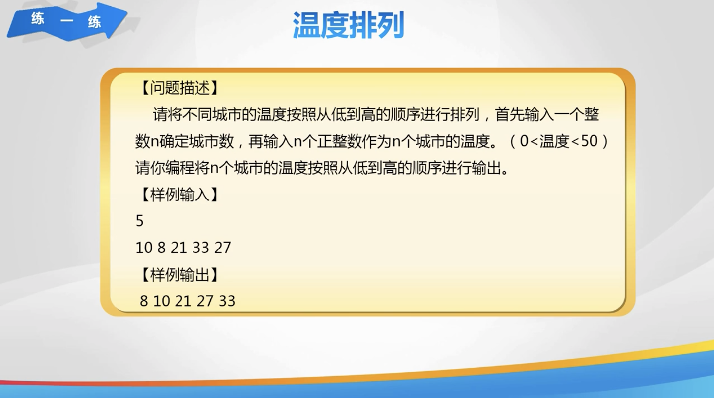
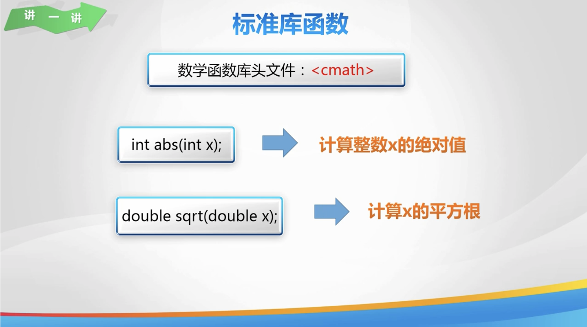
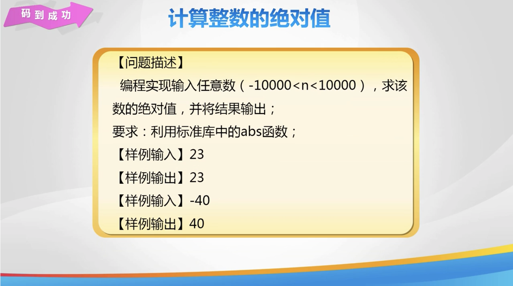
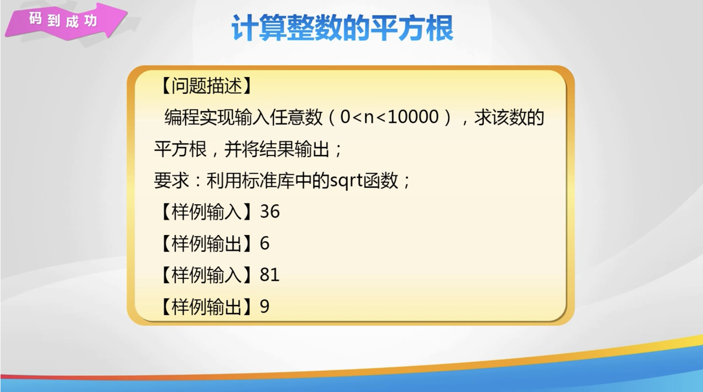
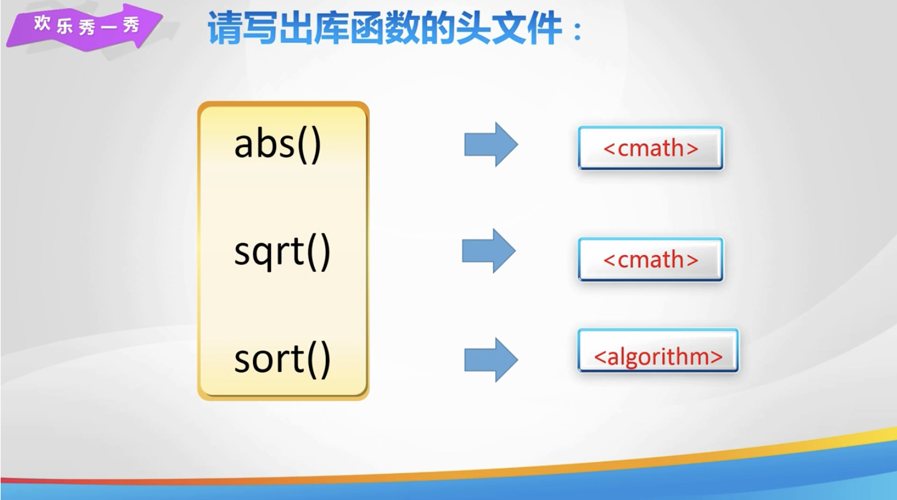
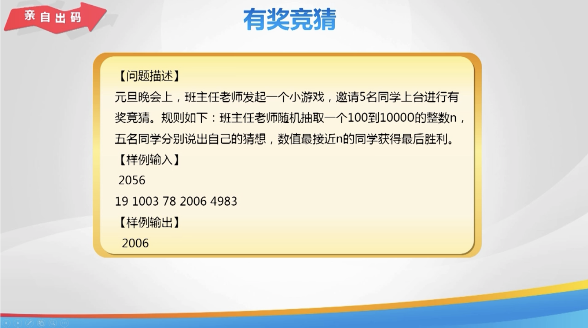

# Day 24

[toc]

## 1. 回到上一讲



## 2. sort 函数





## 3. 练一练



## 4. 绝对值





## 5. 平方根



## 6. 欢乐秀一秀



## 7. 总结


## 8. 亲自出码



## 9. 代码

1. `day 24.cpp`

   ```cpp
   #include <iostream>
   #include <algorithm>
   #include <cmath>
   
   using namespace std;
   
   int main() {
       // // sort 函数
       // int n, a[101] = {};
       // cin >> n;
       // for (int i = 0; i < n; i++) {
       //     cin >> a[i];
       // }
       // sort(a, a + n);
       // for (int i = 0; i < n; i++) {
       //     cout << a[i] << " ";
       // }
   
       // // 温度排列: 使用 sort 函数对温度值从小到大进行排序
       // int n, a[101] = {};
       // cin >> n;
       // for (int i = 0; i < n; i++) {
       //     cin >> a[i];
       // }
       // sort(a, a + n);
       // for (int i = 0; i < n; i++) {
       //     cout << a[i] << " ";
       // }
   
       // // 计算整数的绝对值
       // int n;
       // cin >> n;
       // int res = 0;
       // res = abs(n);
       // cout << "该数的绝对值为: " << res << endl;
   
       // // 计算整数的平方根
       // double n;
       // cin >> n;
       // cout << sqrt(n) << endl;
   
       return 0;
   }
   ```

2. `亲自出码.cpp`

   ```cpp
   #include <iostream>
   
   using namespace std;
   
   // 有奖竞猜
   int main() {
       int n, a[6], res, min = 1001, index;
       cin >> n;
       for (int i = 1; i <= 5; i++) {
           cin >> a[i];
           // 通过绝对值判断数组当中的数与数字 n 的距离
           res = abs(a[i] - n);
           if (min > res) {
               // 存储最小绝对值
               min = res;
               // 记录当前数组元素下标
               index = i;
           }
       }
       cout << a[index] << endl;
       return 0;
   }
   ```

   