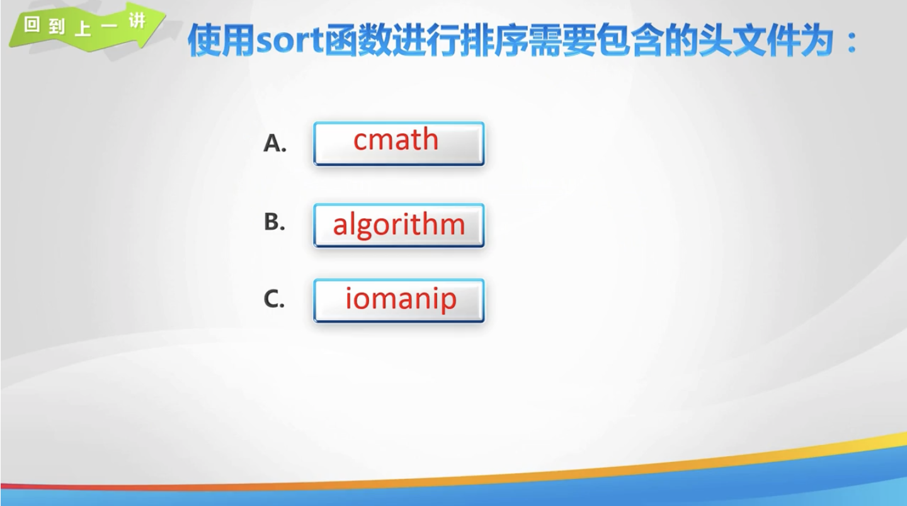
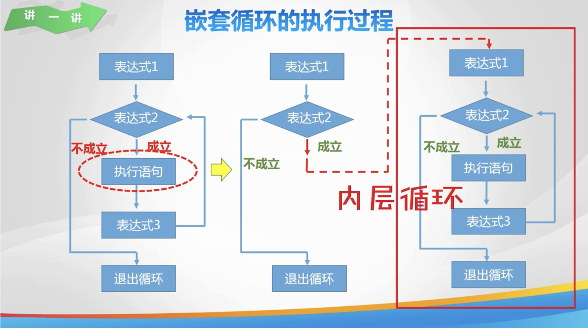
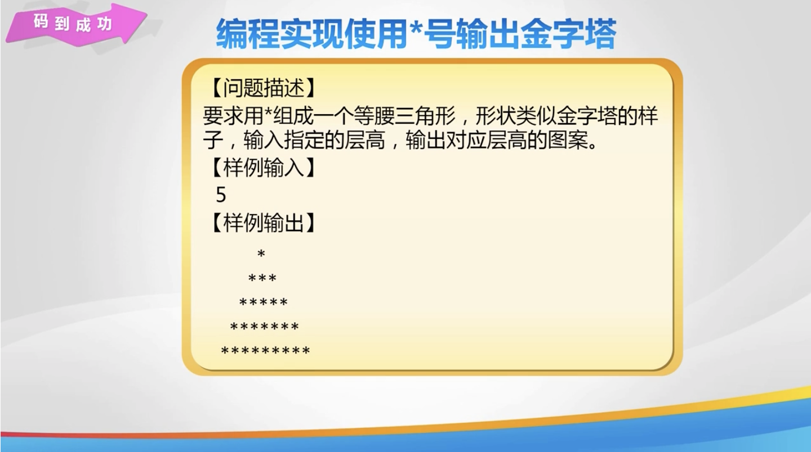

# Day 25

[toc]

## 1. 回到上一讲




## 2. 双重 for 循环 & 输出矩形


## 3. 嵌套循环





## 4. 指定层高金字塔




## 5. 练一练


## 6. 秀一秀


## 7. 总结


## 8. 亲自出码


## 9. 代码

1. `day 25.cpp`

   ```cpp
   #include <iostream>
   
   using namespace std;
   
   int main() {
       // // // 使用双重 for 循环输出指定层高的金字图案
       // // //菱形图案上半部分
       // int n;
       // cin >> n;
       // // 按行输出
       // for (int i = 1; i <= n; i++) {
       //     // 先输出空格, 空格 = 行数 - 当前的行号
       //     for (int j = 1; j <= n - i; j++) {
       //         cout << " ";
       //     }
       //     // 输出 * * 的数量 = 2 * i - 1
       //     for (int k = 1; k <= 2 * i - 1; k++) {
       //         cout << "*";
       //     }
       //     // 每输完一行, 换行
       //     cout << endl;
       // }
       //
       // // 输出菱形图案
       // // 菱形图案下半部分
       // for (int i = 1; i <= n - 1; i++) {
       //     // 输出空格, 空格数量 = 行号
       //     for (int j = 1; j <= i; j++) {
       //         cout << " ";
       //     }
       //     // 输出 * * 的数量 = 2 * (n - i ) - 1
       //     for (int k = 1; k <= 2 * (n - i) - 1; k++) {
       //         cout << "*";
       //     }
       //     // 换行
       //     cout << endl;
       // }
   
       return 0;
   }
   ```

2. `亲自出码.cpp`

   ```cpp
   #include <iostream>
   
   using namespace std;
   
   int main() {
       // // 输出一个 * 号组成的正方形
       // int n;
       // cin >> n;
       // for (int i = 0; i < n; i++) {
       //     // 第一行和最后一行
       //     if (i == 0 || i == n - 1) {
       //         for (int j = 0; j < n; j++) {
       //             cout << "*";
       //         }
       //         cout << endl;
       //     } else { // 对中间的行进行处理
       //         // 输出第一个 *
       //         cout << "*";
       //         // 输出 n - 2 个空格
       //         for (int j = 0; j < n - 2; j++) {
       //             cout << " ";
       //         }
       //         cout << "*"; // 输出最后的 *
       //         cout << endl;
       //     }
       // }
   }
   ```

   