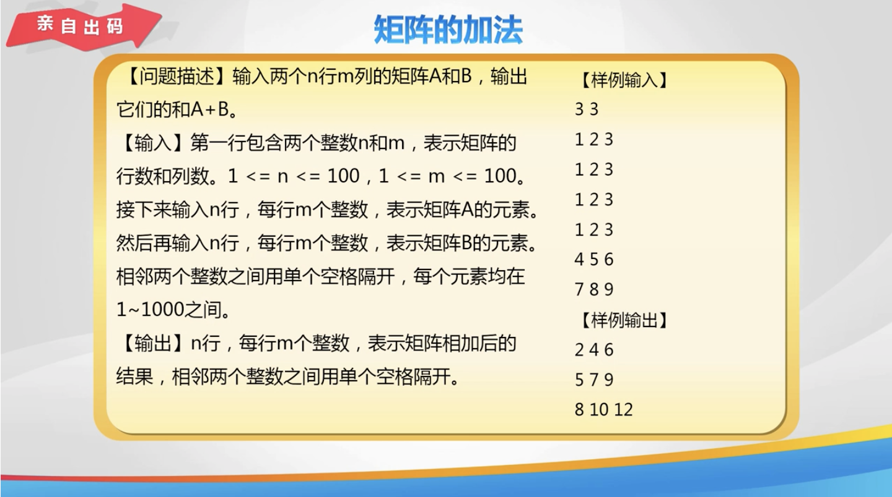

# Lesson 27

[toc]

## 1. 回到上一讲


## 2. 矩阵输入输出及最大值


## 3. 码到成功矩阵的转置


## 4. 练一练 矩阵的交换


## 5. 秀一秀


## 6. 总结


## 7. 亲自出码



## 8. 代码

1. `day 27.cpp`

   ```cpp
   #include <iostream>
   
   using namespace std;
   
   int main() {
       // // 求矩形中的最大值及其行号和列号
       // int a[3][4] = {}, max = 0, row = 0, col = 0;
       // // 输入每个元素的值
       // for (int i = 0; i < 3; i++) {
       //     for (int j = 0; j < 4; j++) {
       //         cin >> a[i][j];
       //         if (a[i][j] > max) {
       //             max = a[i][j];
       //             row = i;
       //             col = j;
       //         }
       //     }
       // }
       // // 输出
       // cout << max << endl;
       // cout << row + 1 << " " << col + 1;
   
       // // 矩形的转置
       // int a[101][101] = {};
       // int n, m;
       // cin >> n >> m;
       // for (int i = 0; i < n; i++) {
       //     for (int j = 0; j < m; j++) {
       //         cin >> a[i][j];
       //     }
       // }
       //
       // for (int i = 0; i < m; i++) {
       //     for (int j = 0; j < n; j++) {
       //         cout << a[j][i] << " ";
       //     }
       //     cout << endl;
       // }
   
       // // 矩阵的交换
       // int a[5][5] = {};
       // int r1, r2;
       // for (int i = 0; i < 5; i++) {
       //     for (int j = 0; j < 5; j++) {
       //         cin >> a[i][j];
       //     }
       // }
       // cin >> r1 >> r2;
       // // 交换两行的元素
       // for (int i = 0; i < 5; i++) {
       //     swap(a[r1 - 1][i], a[r2 - 2][i]);
       // }
       // // 输出交换完成的二维数组
       // for (int i = 0; i < 5; i++) {
       //     for (int j = 0; j < 5; j++) {
       //         cout << a[i][j] << " ";
       //     }
       //     cout << endl;
       // }
   
       // return 0;
   }
   ```

2. `亲自出码.cpp`

   ```cpp
   #include <iostream>
   
   using namespace std;
   
   int main() {
       // // 矩阵的加法
       // int a[100][100] = {}, b[100][100] = {};
       // int n, m;
       // cin >> n >> m;
       // for (int i = 0; i < n; i++) {
       //     for (int j = 0; j < m; j++) {
       //         cin >> a[i][j];
       //     }
       // }
       // for (int i = 0; i < n; i++) {
       //     for (int j = 0; j < m; j++) {
       //         cin >> b[i][j];
       //     }
       // }
       // // 输出两个数字矩阵的和
       // for (int i = 0; i < n; i++) {
       //     for (int j = 0; j < m; j++) {
       //         cout << a[i][j] + b[i][j] << " ";
       //     }
       //     cout << endl;
       // }
       //
       // return 0;
   }
   ```