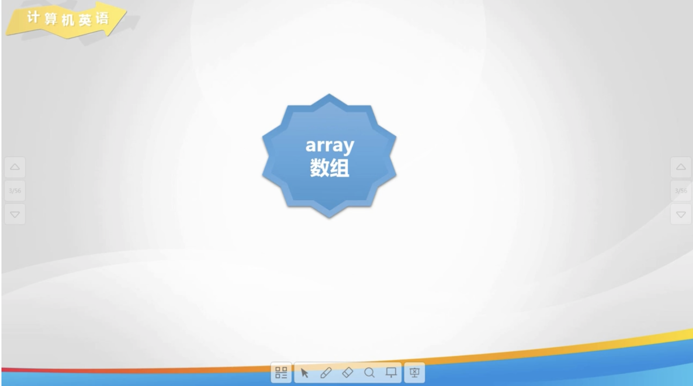

# Lesson 28

[toc]

## 1. 回到上一讲


## 2. 计算机英语



## 3. 字行符型数组


## 4. 字符串定义


## 5. 字符串输入输出


## 6. 统计数字字符个数


## 7. 练一练: 单词翻转


## 8. 欢乐秀一秀


## 9. 总结


## 10. 亲自出码


## 11. 代码

1. 'day 28.cpp'

   ```cpp
   #include <iostream>
   
   using namespace std;
   
   int main() {
       // // 统计数字字符的个数
       // // 定义字符型数组
       // char a[255];
       // // 初始化
       // int n;
       // cin >> n;
       // for (int i = 0; i < n; i++) {
       //     cin >> a[i];
       //
       // }
       // // 统计数字字符的个数
       // int count = 0;
       // for (int i = 0; i < n; i++) {
       //     if (a[i] >= '0' && a[i] <= '9') {
       //         count++;
       //     }
       // }
       // // 输出
       // cout << count << endl;
   
       // // 定义字符串并初始化为"noip"
       // char a[5] = "noip";
       // char b[5] = {"noip"};
       // char c[5] = {'n', 'o', 'i', 'p', '\0'};
   
       // // 字符串的输入和输出
       // char b[5];
       // // 有空格
       // cin.getline(b, 5);
       // cout << b;
       // // 无空格
       // for (int i = 0; i < 4; i++) {
       //     cin >> b[i];
       // }
       // for (int i = 0; i < 4; i++) {
       //     cout << b[i];
       // }
       // // 第三种方式
       // cin >> b;
       // cout << b;
   
       // // 统计数字字符的个数, 并输出其他字符
       // char str[100];
       // // 输入字符串
       // cin.getline(str, 100);
       // // 遍历字符串, 遇到 '\0' 结束
       // int count = 0;
       // for (int i = 0; i < 100; i++) {
       //     // 字符串末尾, 循环停止
       //     if (str[i] == '\0') {
       //         break;
       //     } else if (str[i] >= '0' && str[i] <= '9') {
       //         count++;
       //     } else {
       //         cout << str[i];
       //     }
       // }
       // // 输出数字字符的个数
       // cout << endl;
       // cout << count << endl;
   
       // // 单词翻转
       // char a[501];
       // cin.getline(a, 501);
       // // 遍历输出, 求字符串长度 strlen(数组名) cstring
       // int lena = strlen(a);
       // int flag = 0, last = 0, start = 0;
       // for (int i = 0; i < lena; i++) {
       //     // 碰到空格或最后一个字符
       //     if (a[i] == ' ' || i == lena - 1) {
       //         // 标记
       //         flag++;
       //         if (i == lena - 1) {
       //             last = i;
       //         } else {
       //             last = i - 1;
       //         }
       //         // 输出字符
       //         for (int j = last; j >= start; j--) {
       //             cout << a[j];
       //         }
       //         //  输出空格
       //         if (flag == 1) {
       //             cout << ' ';
       //             flag = 0;
       //         }
       //         // 继续下一个单词
       //         start = i + 1;
       //     }
       // }
   
       // return 0;
   }
   ```

2. `亲自出码.cpp`

   ```cpp
   #include <iostream>
   
   using namespace std;
   
   int main() {
       // char str[100];
       // // 输入字符串
       // cin.getline(str, 100);
       // // 遍历字符串, 遇到 '\0' 结束
       // int count = 0;
       // for (int i = 0; i < 100; i++) {
       //     // 字符串末尾, 循环停止
       //     if (str[i] == '\0') {
       //         break;
       //     } else if (str[i] >= '0' && str[i] <= '9') {
       //         count++;
       //     } else {
       //         cout << str[i];
       //     }
       // }
       // // 输出数字字符的个数
       // cout << endl;
       // cout << count << endl;
       // return 0;
   }
   
   ```

   