# Lesson 29

[toc]

## 1. 回到上一讲

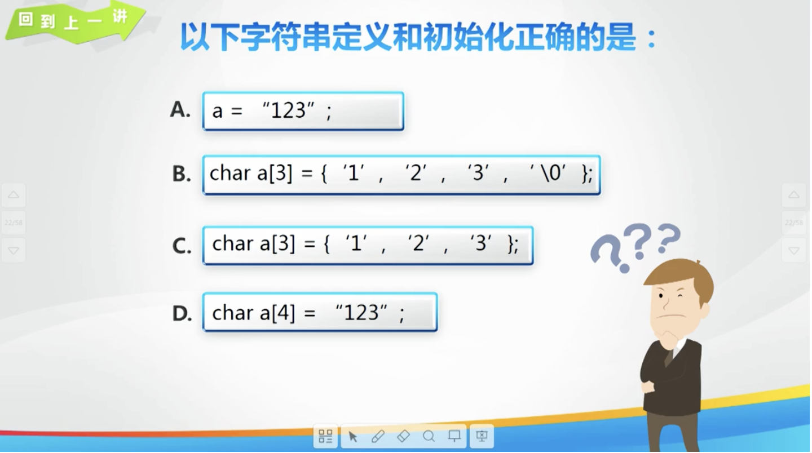

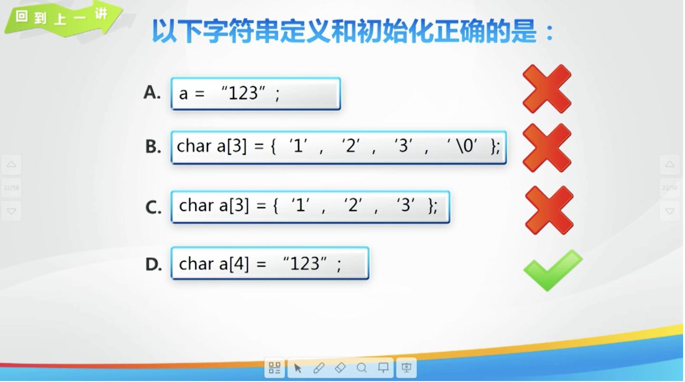

## 2. 计算机英语

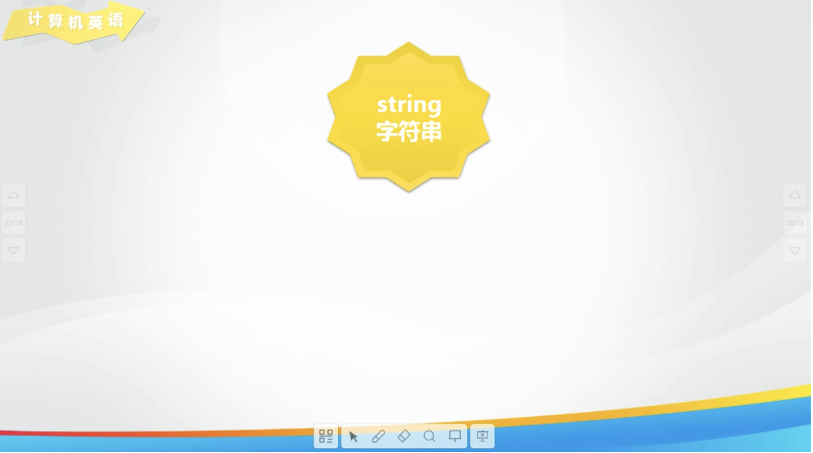

## 3. 字符串 string 类型

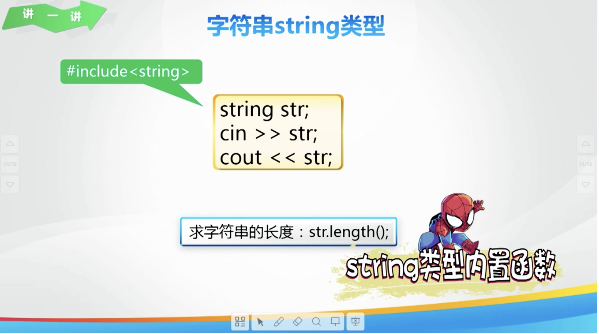

## 4. string 类型的基本用法

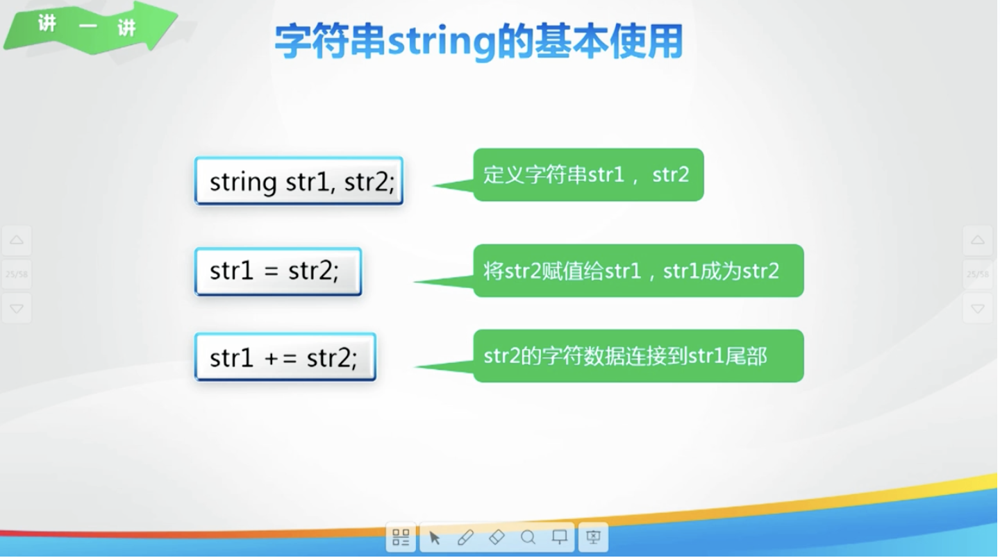

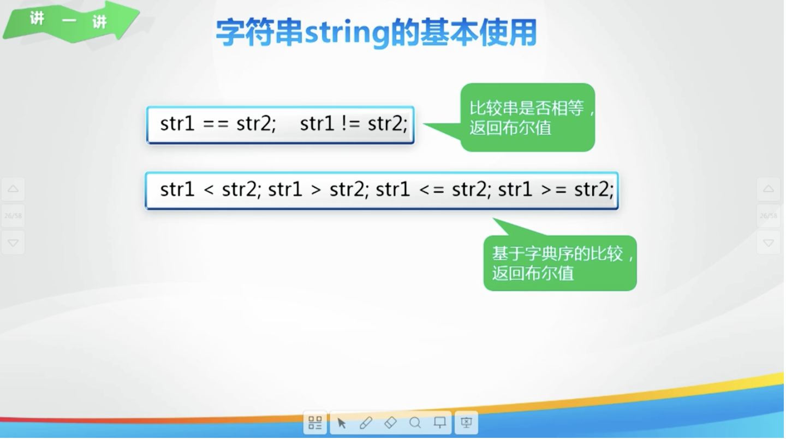

## 5. 大小写字母互换

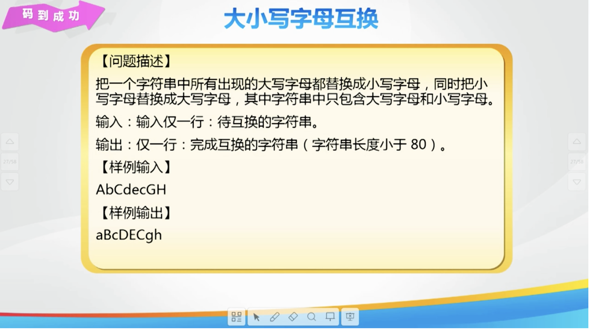

## 6. 练一练: 统计字符

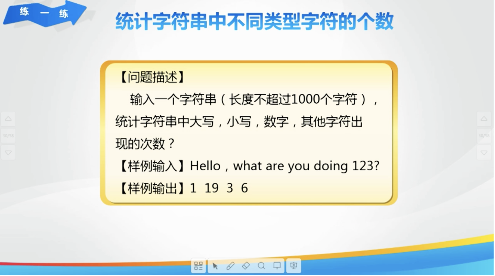

## 7. 欢乐秀一秀

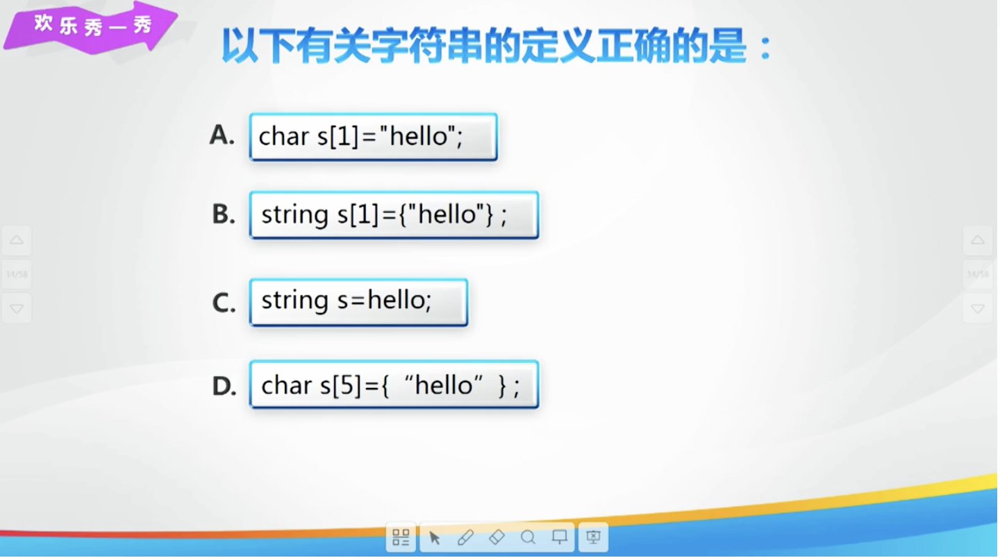

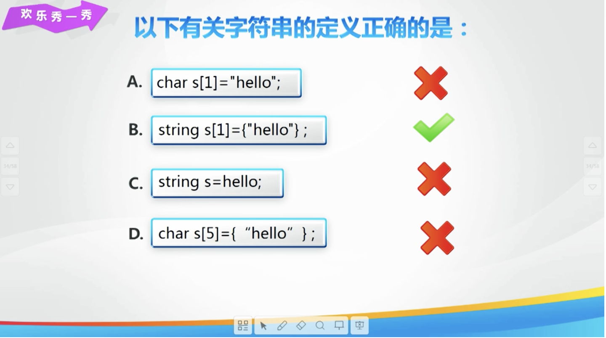

## 8. 总结

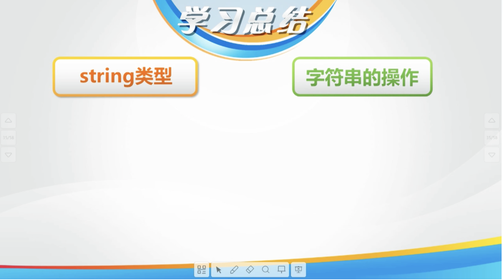

## 9. 亲自出码

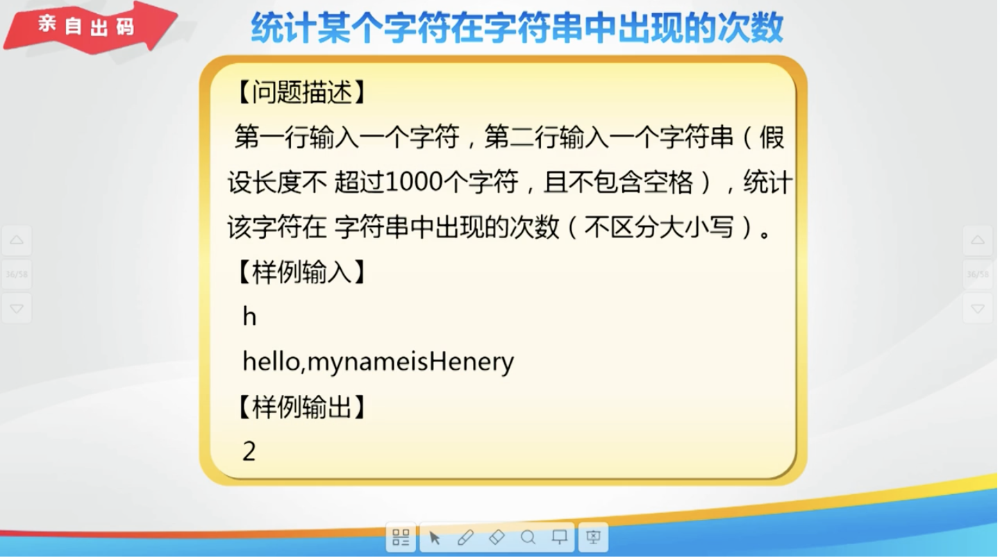

## 10. 代码

1. `day29.cpp`

   ```cpp
   #include <iostream>
   #include <cstring>
   
   using namespace std;
   
   int main() {
       // // 使用 string 类型变量存储字符串
       // string str;
       // // 输入字符串
       // cin >> str;
       // // 输出字符串
       // cout << str;
       // // 获取字符串的长度
       // cout << endl;
       // cout << str.length();
   
       // // 字符串的使用
       // string str1, str2;
       // cin >> str1 >> str2;
       // // 操作1: 比较两个字符串
       // cout << "str1 > str2: " << (str1 > str2) << endl;
       // cout << "str1 < str2: " << (str1 < str2) << endl;
       // cout << "str1 = str2: " << (str1 == str2) << endl;
       // // 操作2: 字符串 str2 赋值给 str1
       // str1 = str2;
       // // 操作 3: 拼接字符串
       // str1 += str2;
       // cout << str1 << " " << str2 << endl;
   
       // // 统计不同类型字符出现的次数
       // char a[1001];
       // cin.getline(a, 1001);
       // int l = strlen(a); // cstring 头文件
       // int dx = 0, xx = 0, sz = 0, qt = 0;
       // for (int i = 0; i < l; i++) {
       //     if (a[i] >= 'A' && a[i] <= 'Z') {
       //         dx++;
       //     } else if (a[i] >= 'a' && a[i] <= 'z') {
       //         xx++;
       //     } else if (a[i] >= '0' && a[i] <= '9') {
       //         sz++;
       //     } else {
       //         qt++;
       //     }
       // }
       // cout << dx << " " << xx << " " << sz << " " << qt;
   
       return 0;
   }
   ```

2. `亲自出码.cpp`

   ```cpp
   #include <iostream>
   #include <cstring>
   
   using namespace std;
   
   int main() {
       // char flag;
       // string a;
       // int cnt = 0;
       // int l, i;
       // cin >> flag >> a;
       // l = a.length();
       // for (int i = 0; i < l; i++) {
       //     if ((a[i] == flag || a[i] + 32 == flag || a[i] - 32 == flag) &&
       //         (a[i] <= 'z' && a[i] >= 'a' || a[i] <= 'Z' && a[i] >= 'A')) {
       //         cnt++;
       //     }
       // }
       // cout << cnt;
       // return 0;
   }
   ```

   