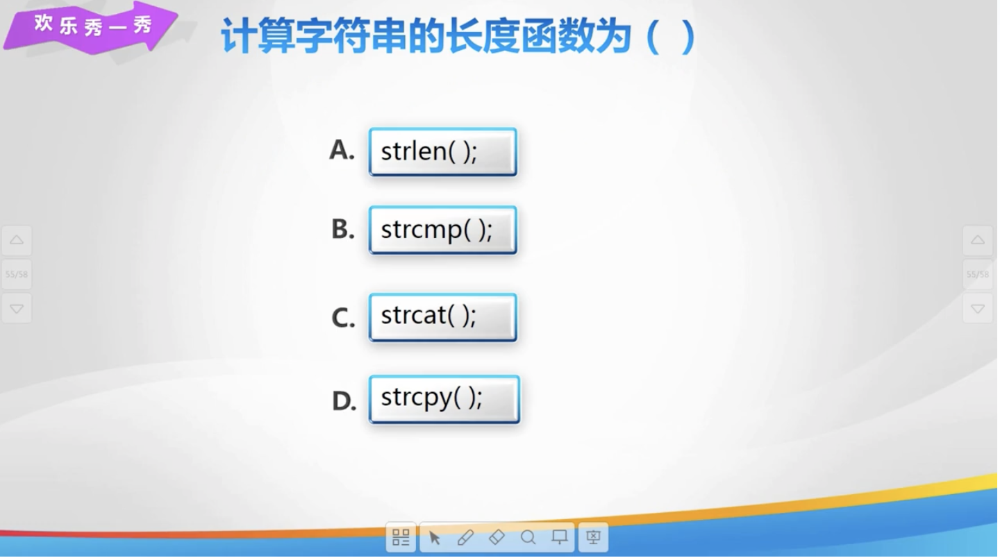

# Lesson 30

[toc]

## 1. 回到上一讲


## 2. strlen 函数


## 3. 码到成功


## 4. strcat 函数


## 5. strcpy 函数


## 6. strcmp 函数


## 7. string 和 char 比较


## 8 . 练一练


## 9. 欢乐秀一秀




## 10. 总结


## 11. 亲自出码


## 12. 代码

1. `day30.cpp`

   ```cpp
   #include <iostream>
   #include <cstring>
   
   using namespace std;
   
   int main() {
       // // strlen 函数
       // char arr[6] = "hello";
       // cout << strlen(arr) << endl;
       // cout << strlen("noip") << endl;
   
       // // 反向输出字符串
       // char a[100];
       // cin.getline(a, 100);
       // int n = strlen(a);
       // // 倒序遍历数组
       // for (int i = n - 1; i >= 0; i--) {
       //     cout << a[i] << a[i] << endl;
       // }
   
       // // 字符串拼接 strcat()
       // char a[20] = "hello";
       // char b[6] = "world";
       // // 将 b 拼接在 a 的后面
       // cout << strcat(a, b) << endl;
       // cout << a << endl;
       // cout << strcat(a, "noip") << endl;
       // cout << a << endl;
   
       // // 字符串复制 strcpy()
       // char a[20] = "hello";
       // char b[6] = "world";
       // cout << strcpy(a, b) << endl;
       // cout << a << endl;
       // cout << strcpy(a, "noip") << endl;
   
       // // 字符串比较 strcmp()
       // char a[20] = "hello";
       // char b[6] = "world";
       // cout << strcmp(a, b) << endl;
       // cout << strcmp("noip", a) << endl;
       // cout << strcmp(a, a) << endl;
   
       // // 子串判等
       // char str1[101] = {}, str2[101] = {};
       // cin.getline(str1, 101);
       // cin.getline(str2, 101);
       // char s1[101] = {}, s2[101] = {};
       // int index1 = 0, index2 = 0;
       // for (int i = 0; i < strlen(str1); i++) {
       //     if (str1[i] != ' ') {
       //         if (str1[i] >= 'A' && str1[i] <= 'Z') {
       //             s1[index1++] = str1[i] + 32;
       //         } else {
       //             s1[index1++] = str1[i];
       //         }
       //     }
       // }
       // for (int i = 0; i < strlen(str1); i++) {
       //     if (str2[i] != ' ') {
       //         if (str2[i] >= 'A' && str2[i] <= 'Z') {
       //             s2[index2++] = str2[i] + 32;
       //         } else {
       //             s2[index2++] = str2[i];
       //         }
       //     }
       // }
       // // 比较字符串
       // if (strcmp(s1, s2) == 0) {
       //     cout << "YES" << endl;
       // } else {
       //     cout << "NO" << endl;
       // }
   
       // return 0;
   }
   ```

2. `亲自出码.cpp`

   ```cpp
       // char a[101] = {}, b[101] = {};
       // int n, l;
       // cin >> a;
       // cin >> n;
       // cin >> b;
       // l = strlen(a);
       // cout << l << endl;
       // for (int i = 0; i < l; i++) {
       //     if (a[i] == 'a') {
       //         cout << i + 1 << endl;
       //         break;
       //     }
       // }
       // for (int i = 0; i < n - 1; i++) {
       //     cout << a[i];
       // }
       // cout << b;
       // for (int i = n - 1; i < l; i++) {
       //     cout << a[i];
       //
       // }
       //
       // return 0;
   ```