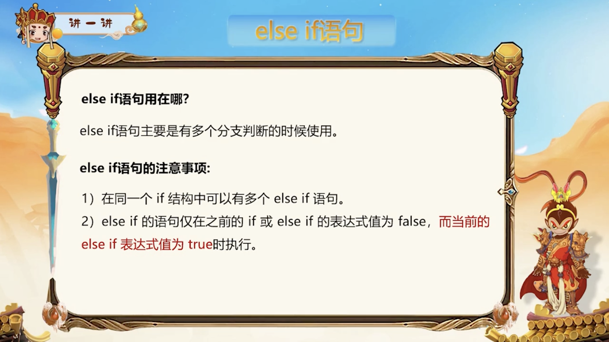

# Lesson 32

[toc]

## 1. 学习目标

## 2. 分支结构

## 3. if 语句的并列与嵌套

## 4. 三目运算符

## 5. switch 语句

## 6. if 语句和 swtich

## 7. while 循环

## 8. do...while 循环

## 9. for 循环

## 10. 循环结构

## 11. 标准库函数

## 12. 文件操作

## 13. 适用情况

