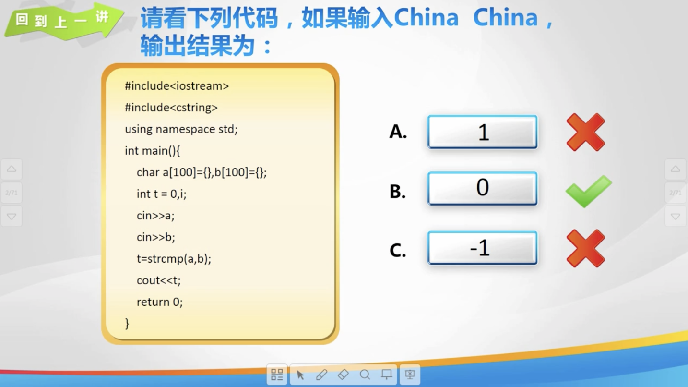
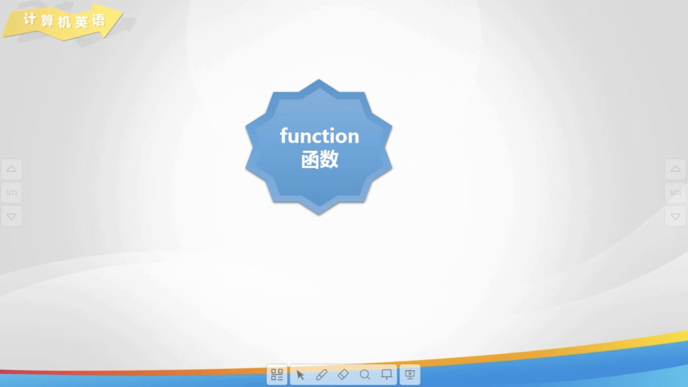

# Lesson 34

[toc]

## 1. 回到上一讲




## 2. 计算机英语



## 3. 认识函数


## 4. 函数的返回值


## 5. 码到成功


## 6. 函数的声明


## 7. 练一练


## 8. 秀一秀


## 9. 总结


## 10. 亲自出码


## 11. 代码

1. `day34.cpp`

   ```cpp
   #include <iostream>
   
   using namespace std;
   
   // 输出 12 个 * 号
   void out_put() {
       for (int i = 0; i < 12; i++) {
           cout << "*";
       }
       cout << endl;
       return;
   }
   
   // 求两个整数的和
   int fun(int a, int b) {
       int sum = 0;
       sum = a + b;
       return sum;
   }
   
   // 找出两个整数中较大数
   void max(int a, int b) {
       if (a > b) {
           cout << a;
       } else {
           cout << b;
       }
   }
   
   // 求四个数中的最大值
   int max(int a, int b, int c, int d) {
       // 把最大值存储到 a 中
       if (a < b) {
           a = b;
       }
       if (a < c) {
           a = c;
       }
       if (a < d) {
           a = d;
       }
       return a;
   }
   
   
   int main() {
       // // 输出 12 个 * 号
       // out_put();
   
       // // 求两个整数的和
       // int res = fun(5,6);
       // cout << res;
   
       // // 找出两个整数中较大数
       // max(99, 98);
   
       // // // 求四个数中的最大值
       // int a, b, c, d;
       // cin >> a >> b >> c >> d;
       // int n = max(a, b, c, d);
       // cout << n;
   
       return 0;
   }
   ```

2. `亲自出码.cpp`

   ```cpp
   #include <iostream>
   #include <string>
   
   using namespace std;
   
   // 判断正整数中是否包含某个数字
   bool check(string a, char b) {
       for (int i = 0; i < a.length(); i++) {
           if (a[i] == b) {
               return true;
           }
       }
       return false;
   }
   
   int main() {
       string c;
       char d;
       cin >> c;
       cin >> d;
       if (check(c, d)) {
           cout << "true";
       } else {
           cout << "false";
       }
   }
   ```

