# Lesson 35

[toc]

## 1. 回到上一讲

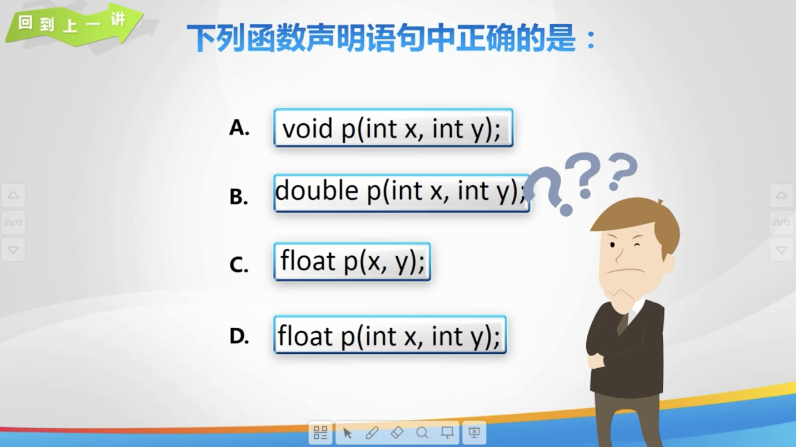

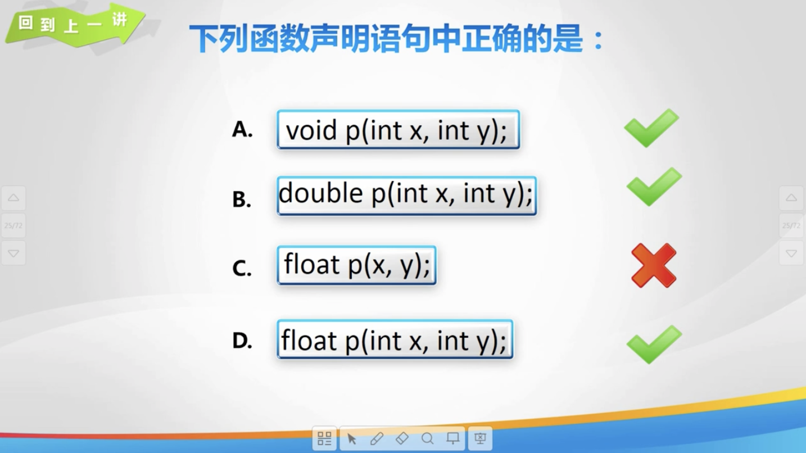

## 2. 码到成功

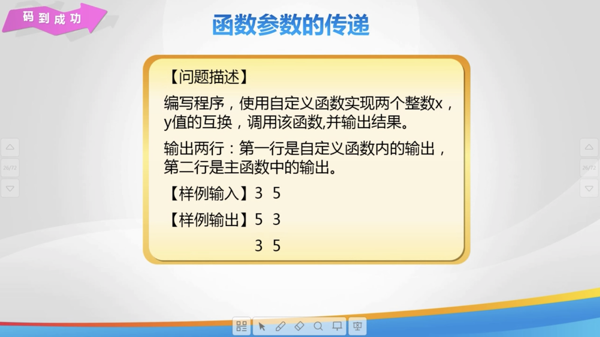

## 3. 传值参数

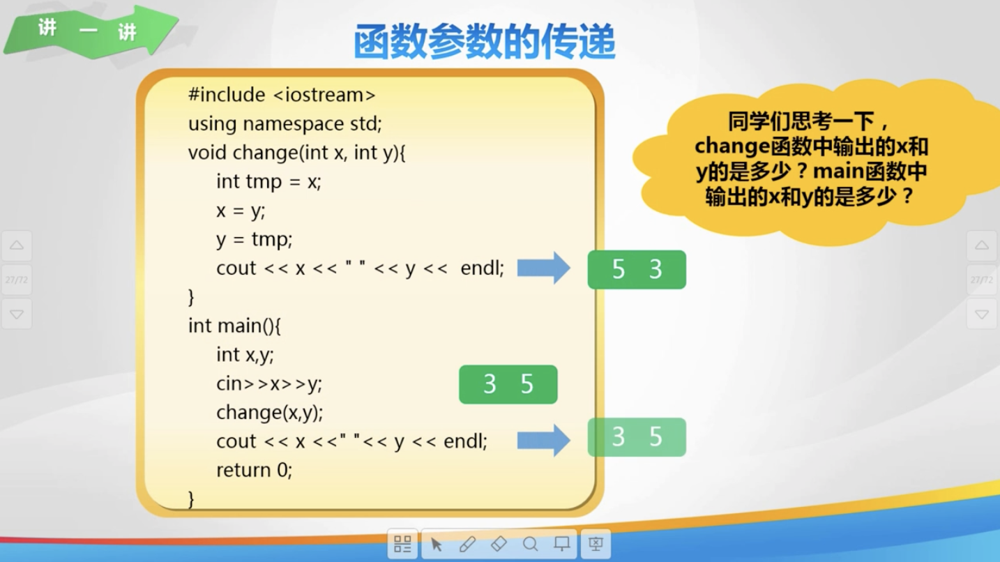

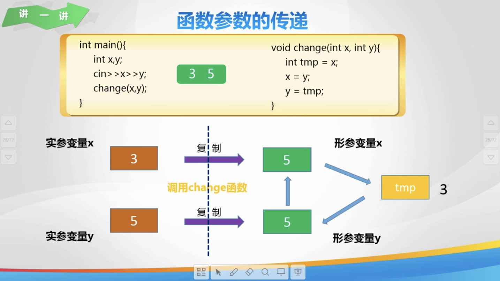

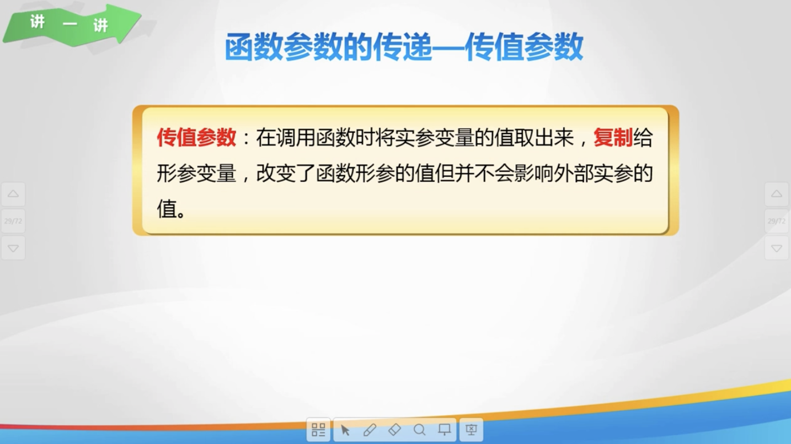

## 4. 传引用参数

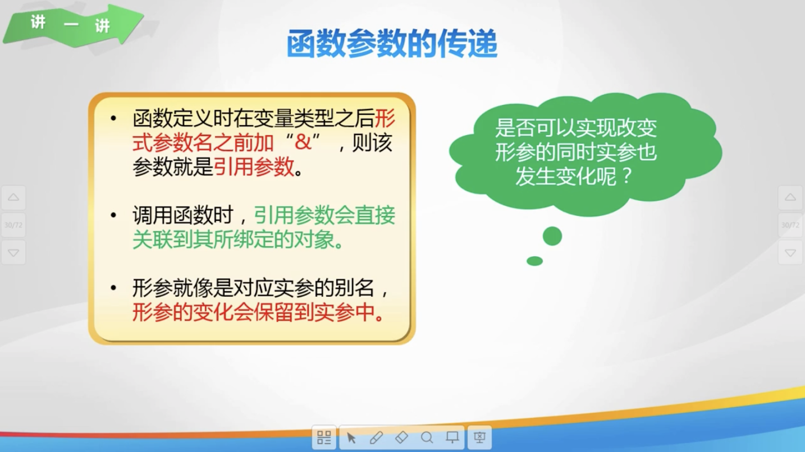

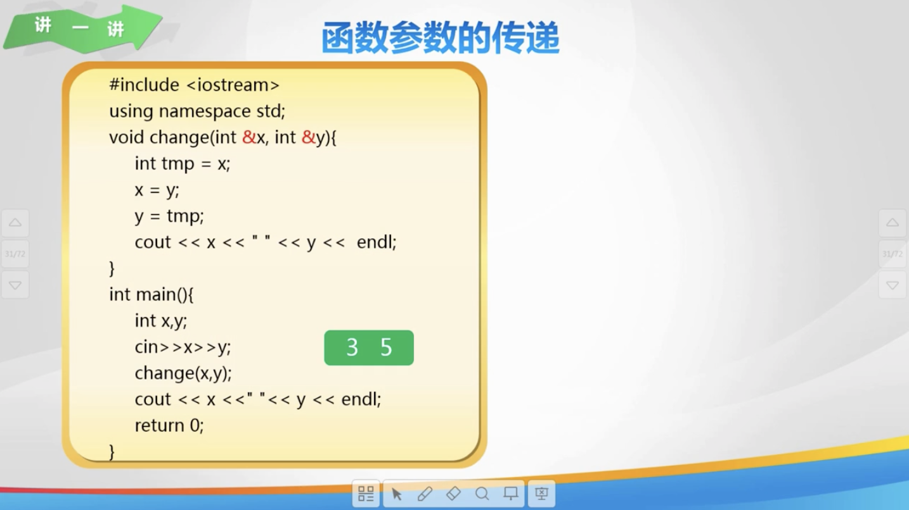

## 5. 一维数组作为参数

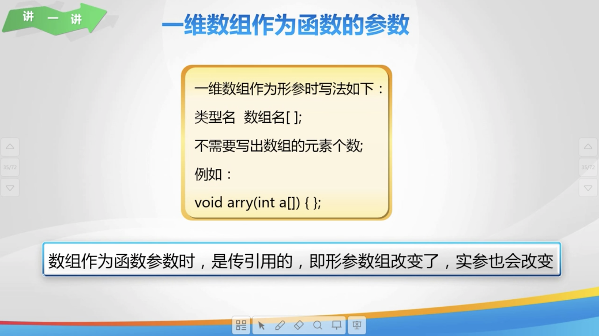

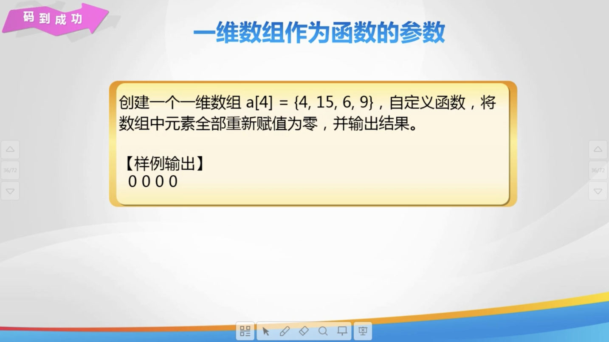

## 6. 练一练

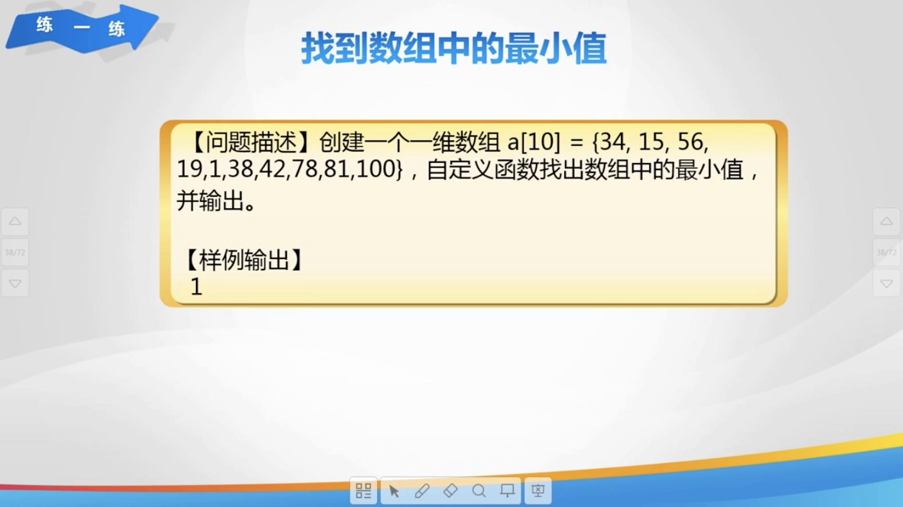

## 7. 秀一秀

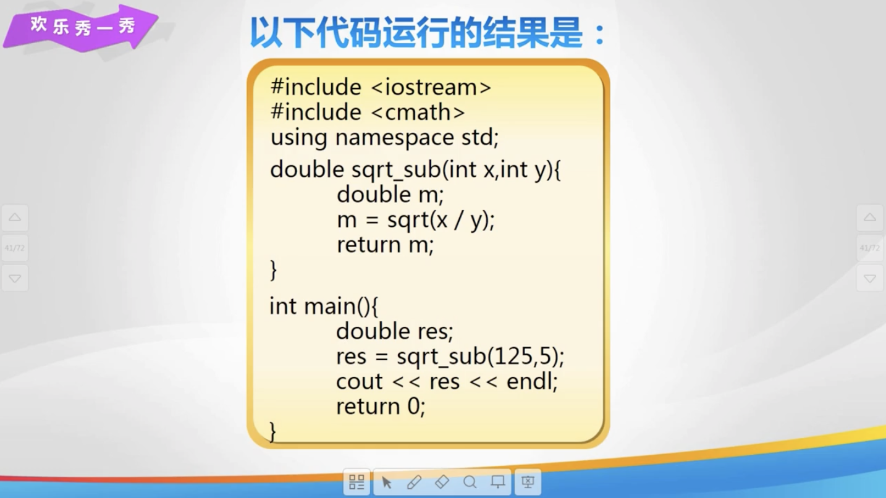

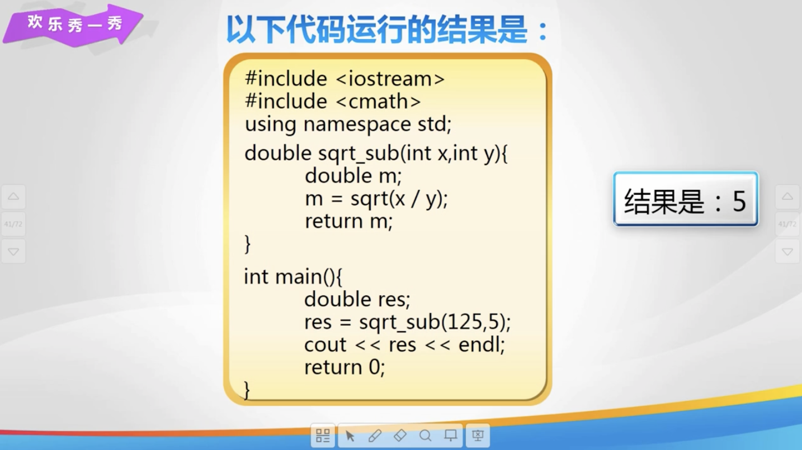

## 8. 总结


## 9. 亲自出码

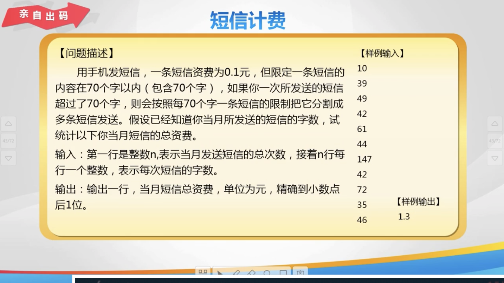

## 10. 代码

1. `day35.cpp`

   ```cpp
   #include <iostream>
   
   using namespace std;
   
   // // 传值参数: 定义函数, 实现两个整数值的交换
   // void change(int x, int y) {
   //     int tmp = x;
   //     x = y;
   //     y = tmp;
   //     cout << x << " " << y << endl;
   //     return;
   // }
   
   // // 传引用参数: 定义函数, 实现两个整数值的交换
   // void change(int &x, int &y) {
   //     int tmp = x;
   //     x = y;
   //     y = tmp;
   //     cout << x << " " << y << endl;
   //     return;
   // }
   
   // // 一维数组作为参数
   // // 定义函数, 将数组元素全部赋值为 0
   // void setToZero(int a[], int length) {
   //     for (int i = 0; i < length; i++) {
   //         a[i] = 0;
   //     }
   //     return;
   // }
   
   int main() {
       // // 传值参数: 定义函数, 实现两个整数值的交换
       // int x, y;
       // cin >> x >> y;
       // change(x, y);
       // cout << x << " " << y << endl;
   
       // // 传引用参数: 定义函数, 实现两个整数值的交换
       // int x, y;
       // cin >> x >> y;
       // change(x, y);
       // cout << x << " " << y << endl;
   
       // // 一维数组作为参数
       // int a[4] = {4, 15, 16, 9};
       // // 调用赋值为 0 的函数
       // setToZero(a, 4);
       // for (int i = 0; i < 4; i++) {
       //     cout << a[i] << " ";
       // }
   
       // return 0;
   }
   ```

2. `亲自出码.cpp`

   ```cpp
   #include<iostream>
   
   using namespace std;
   
   // 定义函数, 根据字数判断短信的条数
   int message(int m) {
       if (m % 70 == 0) {
           return m / 70;
       } else {
           return m / 70 + 1;
       }
   }
   
   int main() {
       int n, m, sum = 0;
       cin >> n; // 发送短信的次数
       for (int i = 0; i < n; i++) {
           cin >> m; // m 表示每条短信的字数
           sum = sum + message(m);
       }
       // 输出
       cout << sum * 0.1 << endl;
       return 0;
   }
   ```