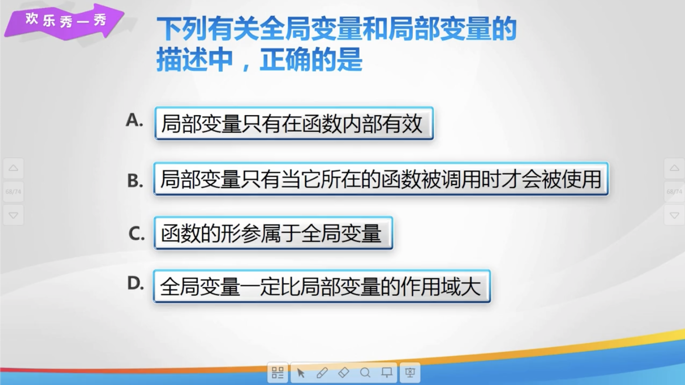

# Lesson 36

[toc]

## 1. 回到上一讲


## 2. 变量的作用域


## 3. 变量的作用域二


## 4. 素数


## 5. 素数筛法


## 6. 练一练


## 7. 欢乐秀一秀




## 8. 总结


## 9. 亲自出码


## 10. 代码

1. `变量的作用域.cpp`

   ```cpp
   #include <iostream>
   
   using namespace std;
   
   
   int x = 10;
   int y = 20;
   
   void test() {
       int x = 30;
       cout << "test: " << x << endl;
       cout << "test: " << y << endl;
   }
   
   // 变量的作用域
   int main() {
       test();
       cout << "main: " << x << endl;
       cout << "main: " << y << endl;
       return 0;
   }
   ```

2. `求指定区间内的素数.cpp`

   ```cpp
   #include <iostream>
   
   using namespace std;
   
   // 判断当前数字是否为素数
   int isPrime(int x) {
       if (x <= 1) {
           return 0;
       }
       for (int i = 2; i < x; i++) {
           if (x % i == 0) {
               return 0;
           }
       }
       return 1;
   }
   
   int main() {
       int m, n;
       cin >> m >> n;
       for (int i = m; i <= n; i++) {
           if (isPrime(i)) {
               cout << i << " ";
           }
       }
       return 0;
   }
   ```

3. `素数筛法.cpp`

   ```cpp
   #include <iostream>
   
   using namespace std;
   
   int isPrime[10001];
   
   int main() {
       int n;
       cin >> n;
       for (int i = 0; i < 10001; i++) {
           isPrime[i] = 1;
       }
       for (int i = 2; i <= n; i++) {
           if (isPrime[i] == 1) {
               for (int j = i * 2; j <= n; j = j + i) {
                   isPrime[j] = 0;
               }
           }
       }
       for (int i = 2; i < n; i++) {
           if (isPrime[i] == 1) {
               cout << i << " ";
           }
       }
       return 0;
   }
   ```

4. `素数对.cpp`

   ```cpp
   #include <iostream>
   #include <cmath>
   
   using namespace std;
   
   // 判断是否为素数
   int prime(int n) {
       for (int i = 2; i <= sqrt(n); i++) {
           if (n % i == 0) {
               return 0;
           }
       }
       return 1;
   }
   
   int main() {
       int n;
       cin >> n;
       if (n < 5) {
           cout << "empty";
           return 0;
       }
       for (int i = 3; i <= n - 2; i++) {
           if (prime(i) && prime(i + 2)) {
               cout << i << " " << i + 2 << endl;
           }
       }
       return 0;
   }
   ```

   

5. `算术表达式求值.cpp`

   ```cpp
   #include <iostream>
   #include <iomanip>
   
   using namespace std;
   
   int add(int a, int b) {
       return a + b;
   }
   
   int sub(int a, int b) {
       return a - b;
   }
   
   int mul(int a, int b) {
       return a * b;
   }
   
   double div(int a, int b) {
       return a * 1.0 / b;
   }
   
   int main() {
       int m, n;
       char x;
       double c;
       cin >> m >> x >> n;
       if (x == '+') {
           c = add(m, n);
       }
       if (x == '-') {
           c = sub(m, n);
       }
       if (x == '*') {
           c = mul(m, n);
       }
       if (x == '/') {
           c = div(m, n);
       }
       cout << fixed << setprecision(2) << c << endl;
   }
   ```