# Lesson 37

[toc]

## 1. 回到上一讲

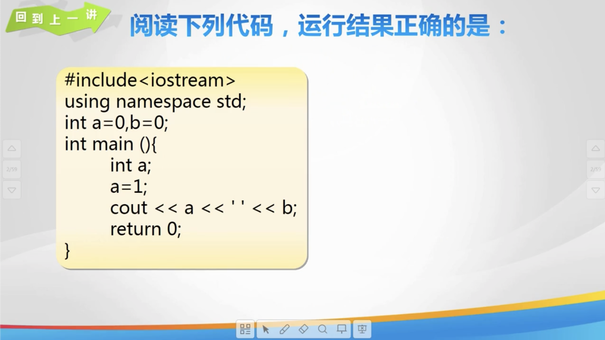

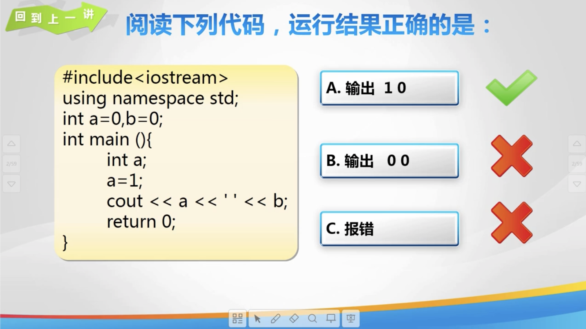

## 2. 计算机英语

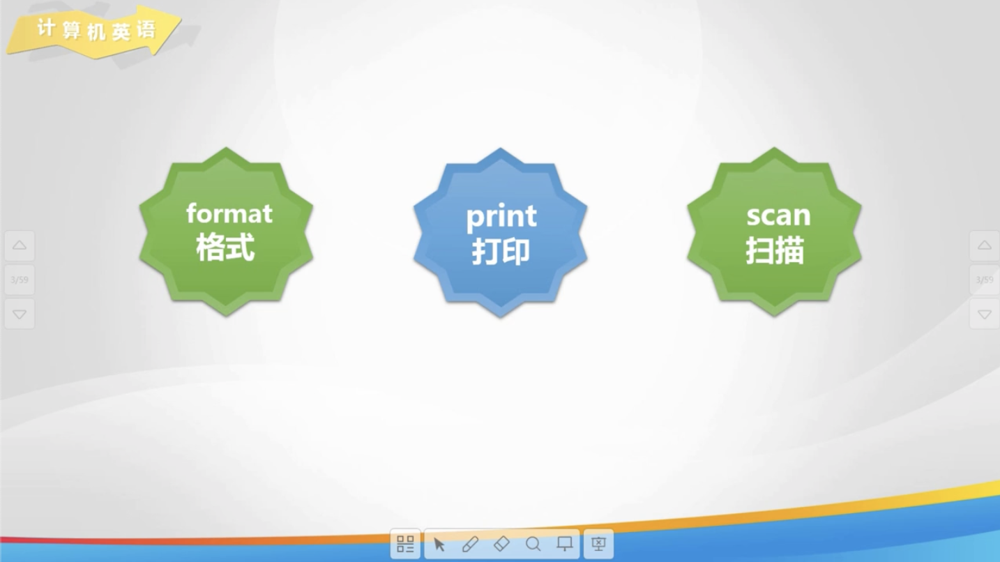

## 3. printf 输出

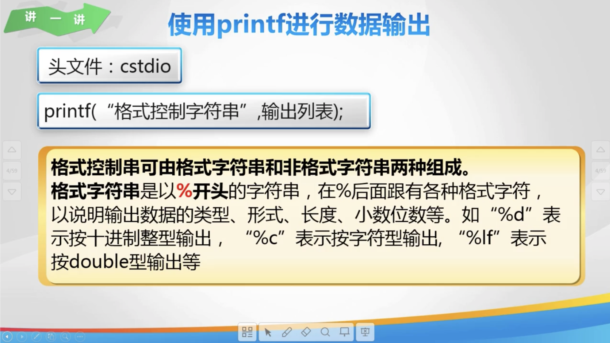

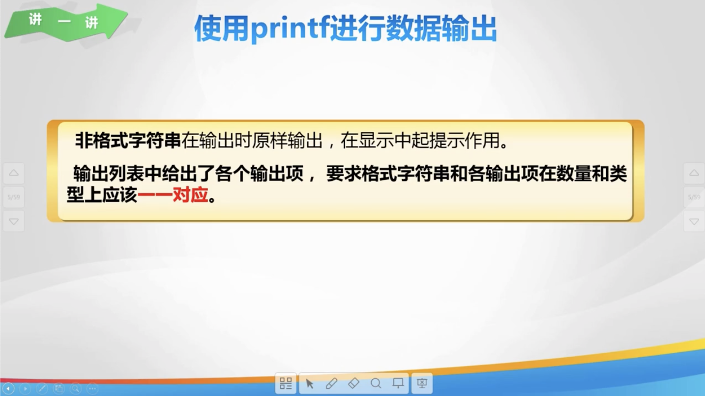

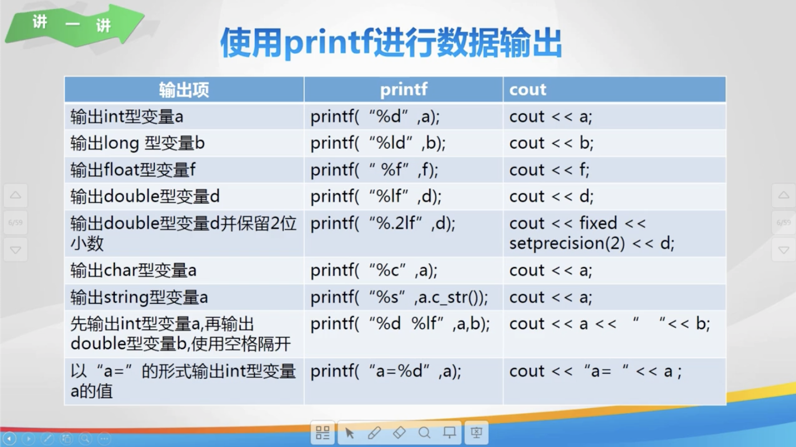

## 4. scanf 进行输入

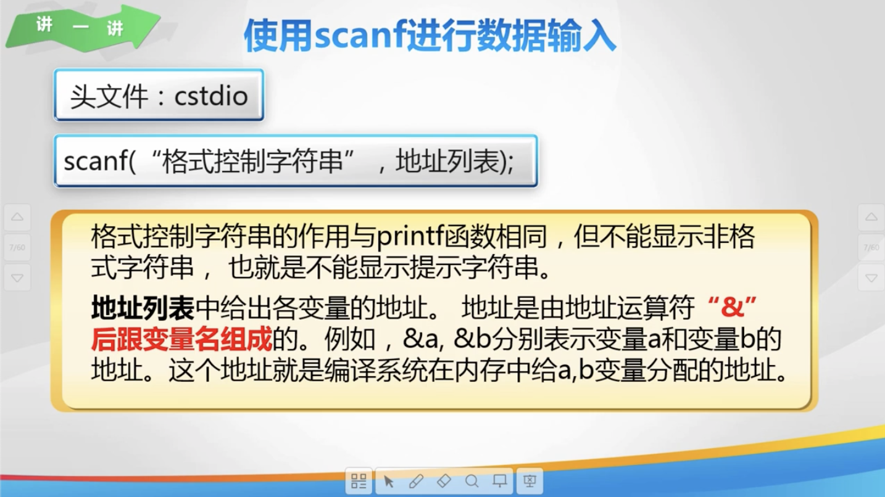

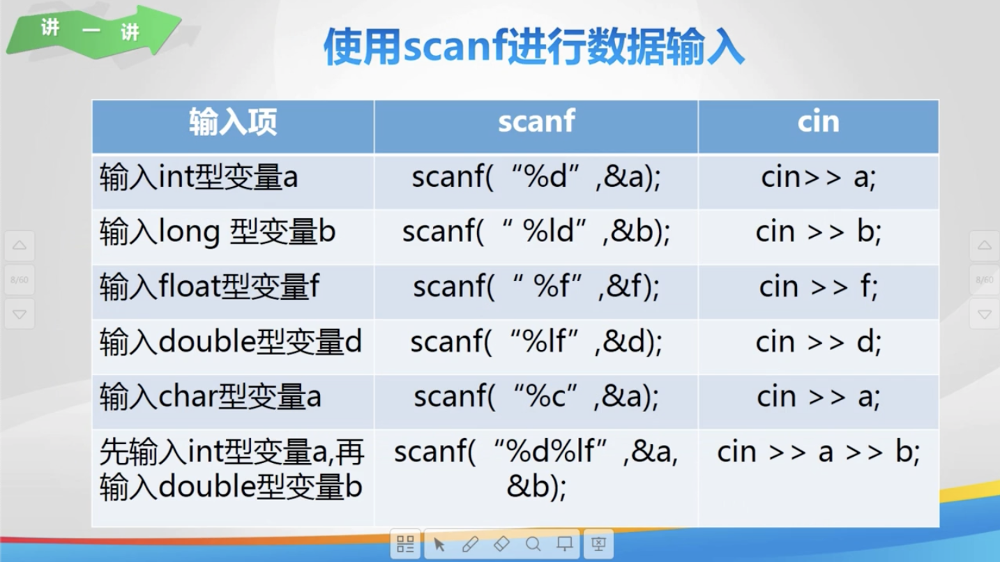

## 5. 练一练

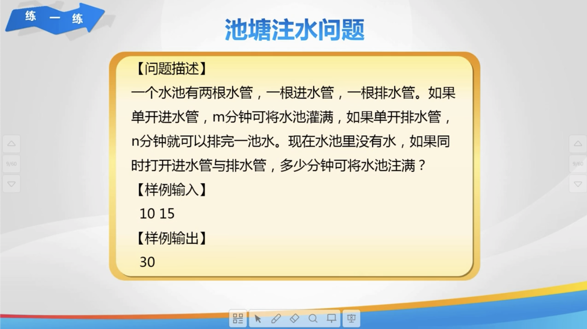

## 6. 欢乐秀一秀

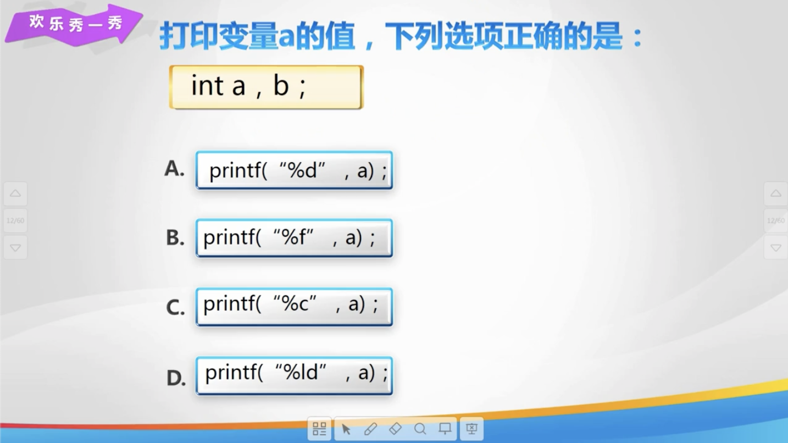

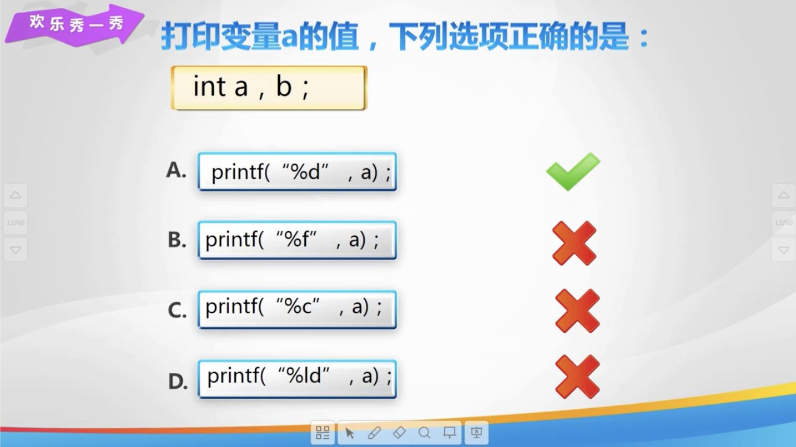

## 7. 总结


## 8. 亲自出码

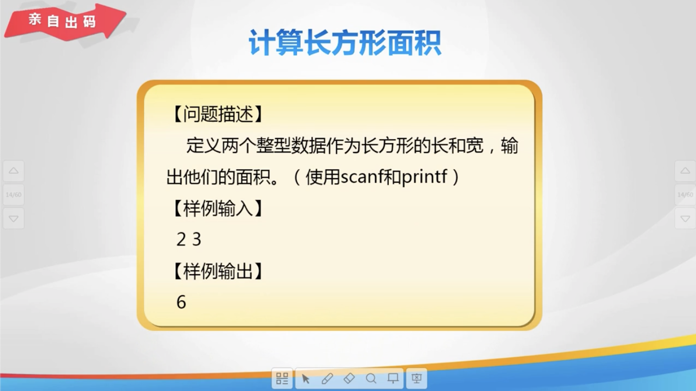

## 9. 代码

1. `使用 printf 进行数据输出.cpp`

   ```cpp
   #include <iostream>
   
   using namespace std;
   
   int main() {
       // printf 进行输出
       int a = 10;
       double b = 12.34;
       char c = 'a';
       printf("%d", a);
       printf("%.2lf", b);
       printf("%\n%c", c);
       // 输出 a = 10
       printf("\na=%d", a);
       return 0;
   }
   ```

2. `使用 scanf 进行数据输入.cpp`

   ```cpp
   #include <iostream>
   #include <cstdio>
   
   using namespace std;
   
   int main() {
       // 使用 scanf 读取数据
       int a;
       double b;
       char c;
       scanf("%d", &a);
       scanf("%lf%c", &b, &c);
       printf("%d\n", a);
       printf("%.2lf", b);
       return 0;
   }
   ```

3. `池塘注水问题.cpp`

   ```cpp
   #include <iostream>
   #include <cstdio>
   
   using namespace std;
   
   // 池塘注水问题
   int main() {
       int a, b; // m 表示注满, n 表示排完
       scanf("%d%d", &a, &b);
       int c = a * b;
       // 速率 = 总水量 / 总时间
       // 注水
       a = c / a;
       // 排水
       b = c / b;
       printf("%d", c / (a - b));
       return 0;
   }
   ```

4. `计算长方形面积.cpp`

   ```cpp
   #include <cstdio>
   
   using namespace std;
   
   // 池塘注水问题
   int main() {
       int a, b;
       scanf("%d%d", &a, &b);
       printf("%d", a * b);
       return 0;
   }
   ```

   