# Lesson 38

[toc]

## 1. 回到上一讲

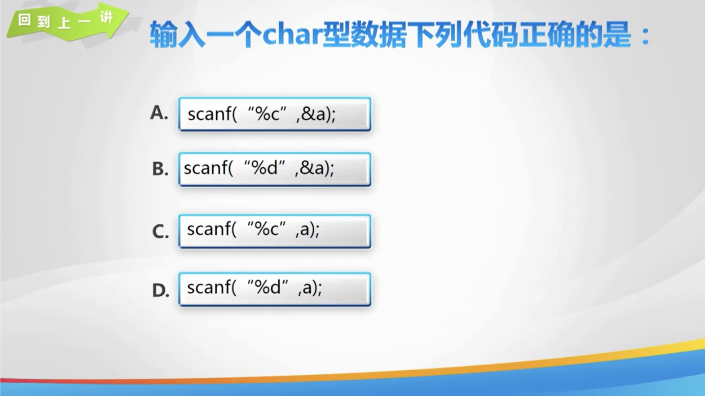

## 2. 结构体

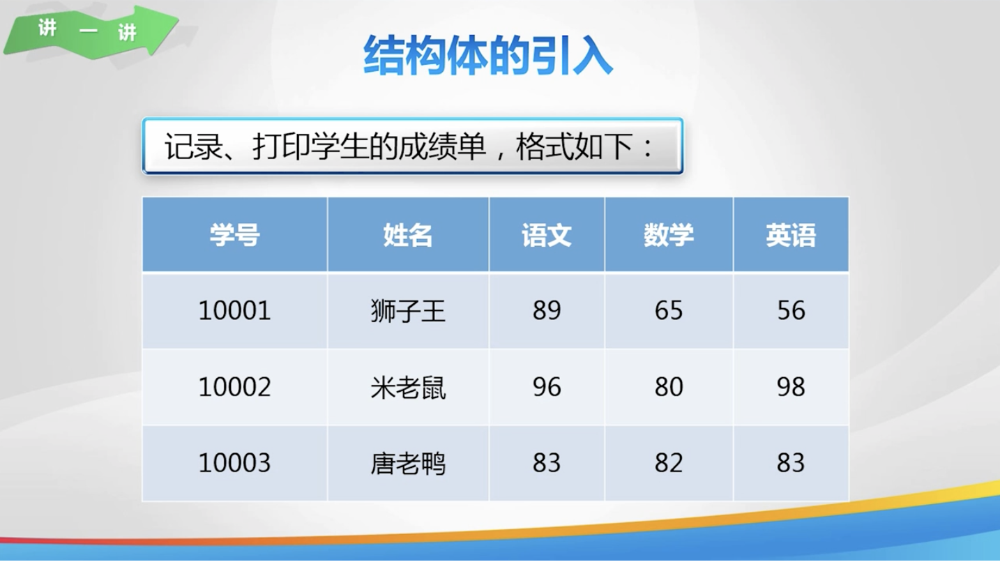

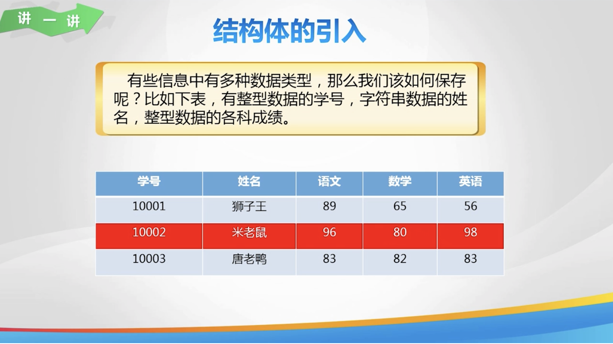

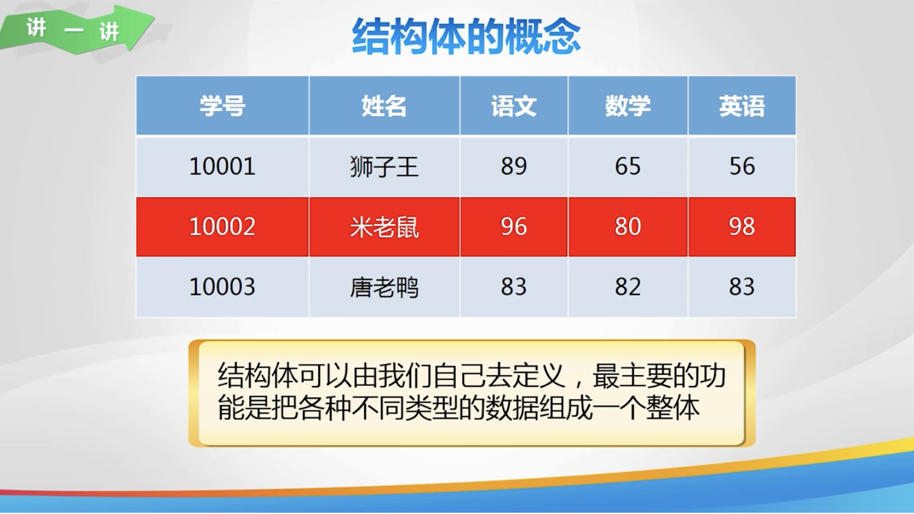

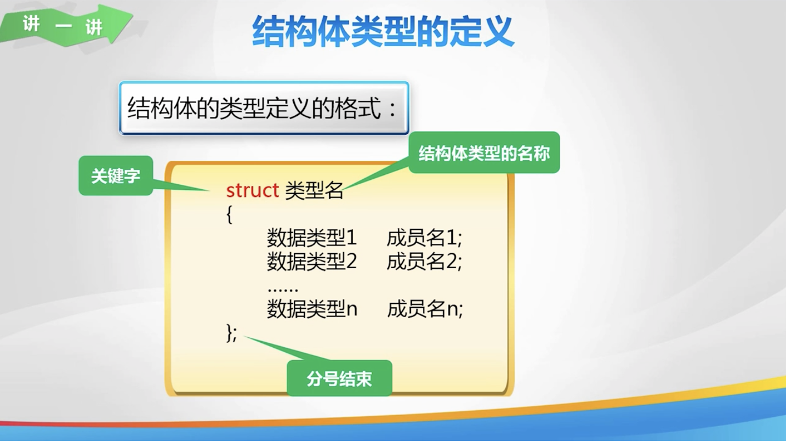

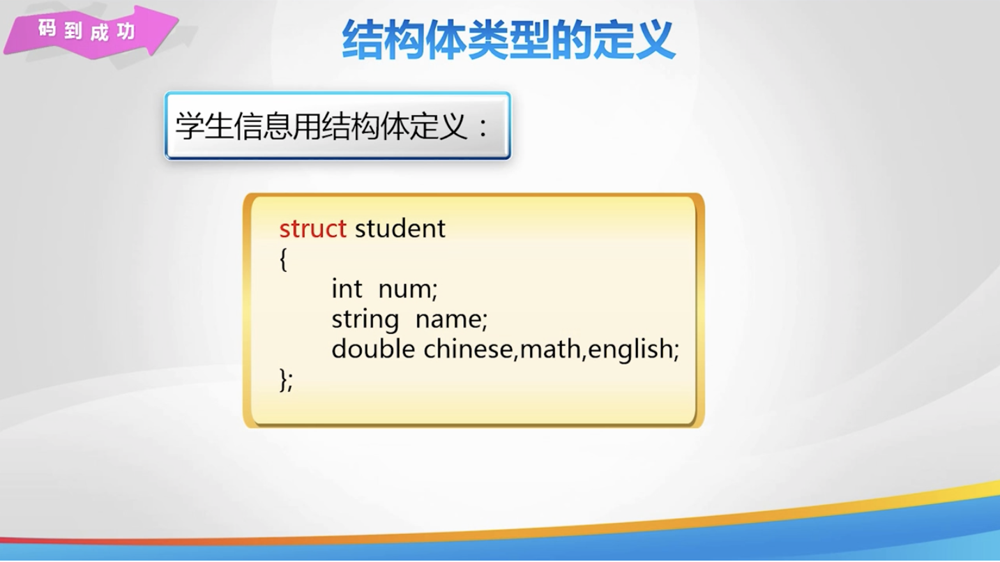

## 3.结构体变量的定义及初始化

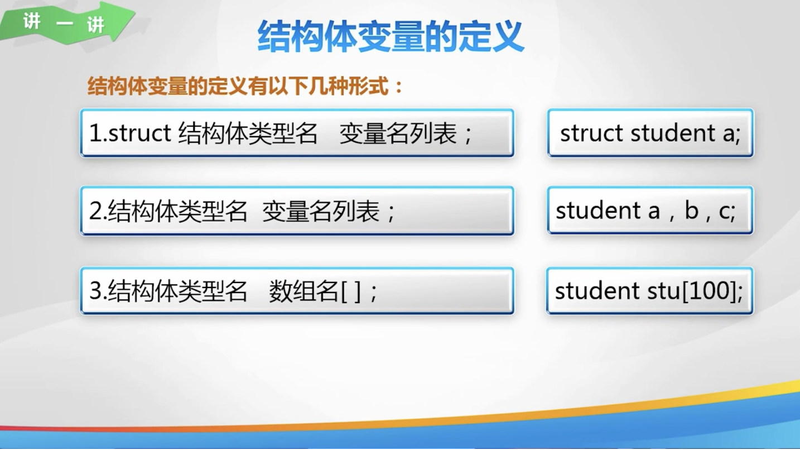

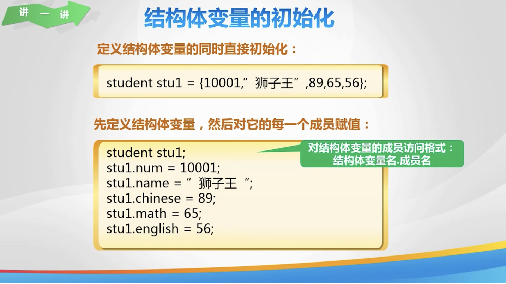

## 4. 结构体数组

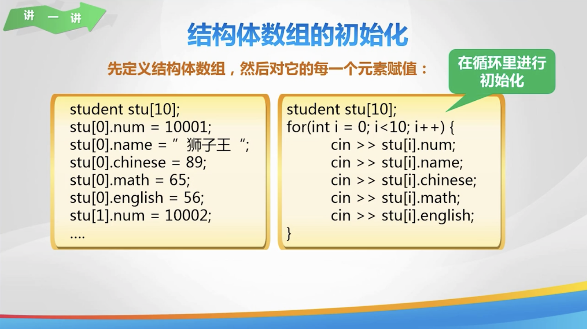

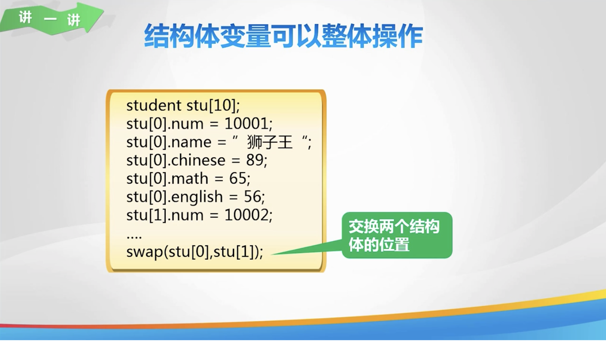

## 5. 成绩统计

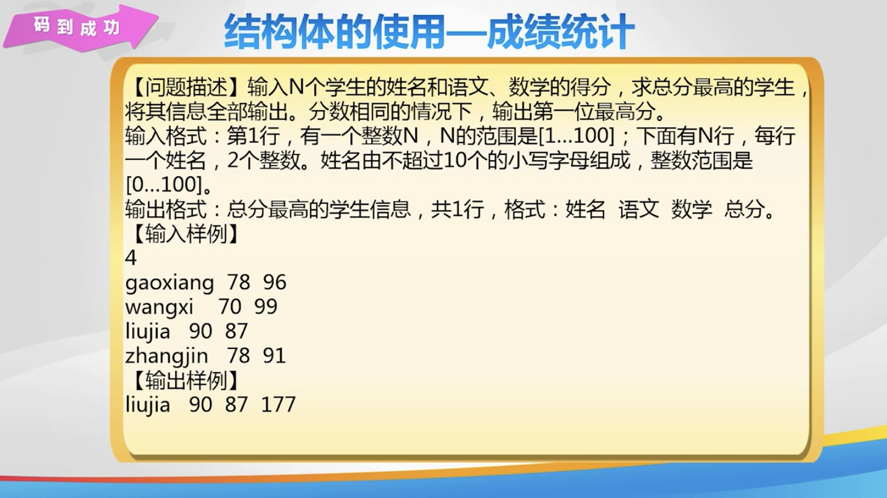

## 6. 练一练

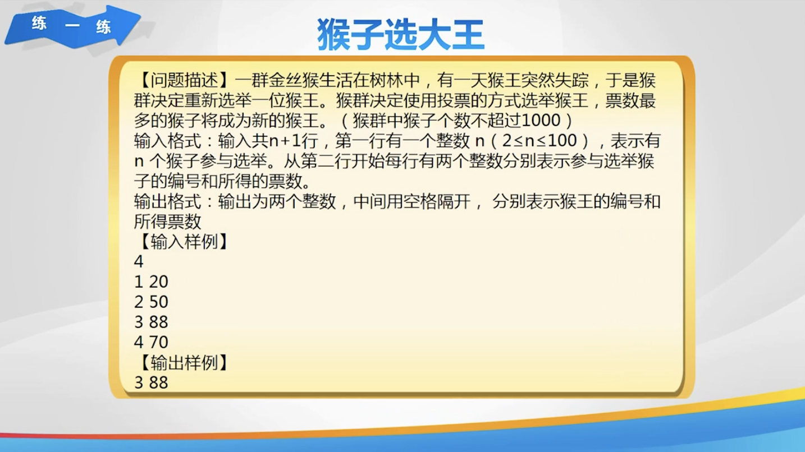

## 7. 欢乐秀一秀

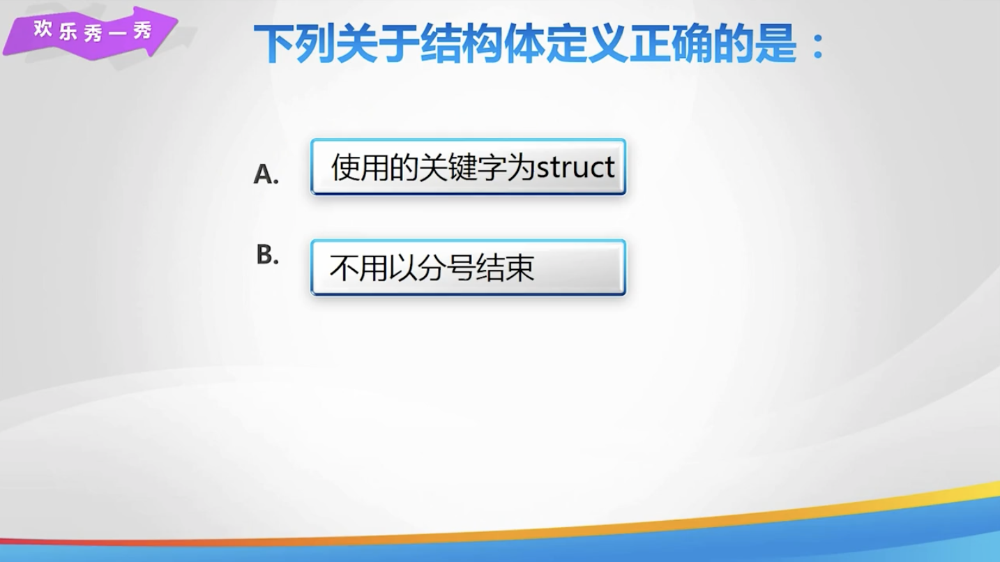

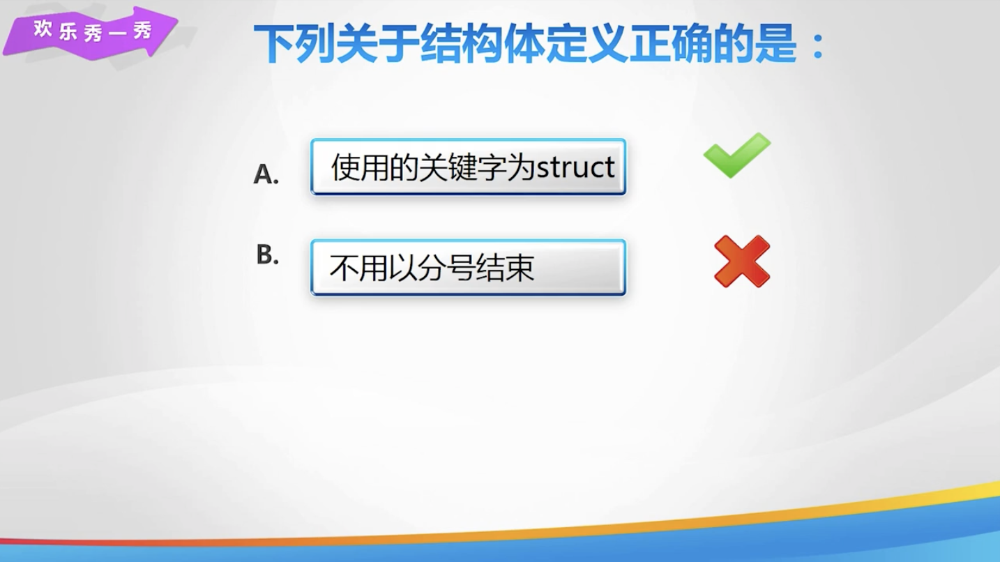

## 8. 总结


## 9. 亲自出码

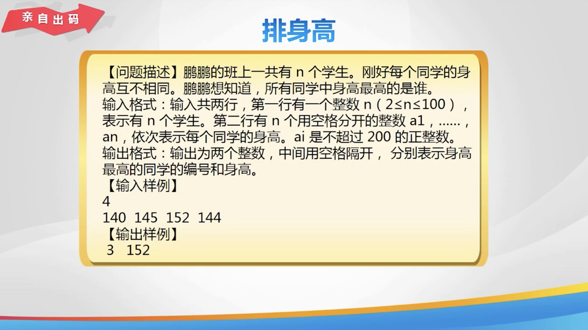

## 10. 代码

1. `结构体变量的定义及初始化 & 结构体数组.cpp`

   ```cpp
   #include <iostream>
   #include <string>
   
   using namespace std;
   
   // 定义结构体 student
   struct student {
       int num;
       string name;
       double chinese, math, english;
   };
   
   int main() {
       // 定义 student 类型的结构体变量
       student a;
       a.num = 10001;
       a.name = "狮子王";
       a.chinese = 89;
       a.math = 56;
       a.english = 65;
       cout << a.name << endl;
   
       // 定义结构体数组存储多个学生信息
       student stu[100];
       for (int i = 0; i < 3; i++) {
           cin >> stu[i].num;
           cin >> stu[i].name;
           cin >> stu[i].chinese;
           cin >> stu[i].math;
           cin >> stu[i].english;
       }
       swap(stu[0], stu[2]);
       for (int i = 0; i < 3; i++) {
           cout << stu[i].num << ' ' << stu[i].name << ' ' << stu[i].chinese << ' ' << stu[i].math << ' ' << ' '
                << stu[i].english << endl;
       }
       return 0;
   }
   ```

2. `结构体的使用 - 成绩统计.cpp`

   ```cpp
   #include <iostream>
   #include <string>
   
   using namespace std;
   struct student {
       string name;
       int chinese, math;
       int total;
   };
   
   student stu[101];
   
   int main() {
       int n;
       cin >> n;
       // 初始化学生数据
       for (int i = 0; i < n; i++) {
           cin >> stu[i].name >> stu[i].chinese >> stu[i].math;
           stu[i].total = stu[i].chinese + stu[i].math;
       }
       // 寻找最高分学生
       int index = 0;
       for (int i = 1; i < n; i++) {
           if (stu[i].total > stu[index].total) {
               index = i;
           }
       }
       cout << stu[index].name << ' ' << stu[index].chinese << ' ' << stu[index].math << ' ' << stu[index].total;
       return 0;
   }
   ```

3. `猴子选大王.cpp`

   ```cpp
   #include <iostream>
   
   using namespace std;
   
   struct m {
       int num;
       int data;
   };
   m a[1001];
   
   // 猴子选大王
   int main() {
       int num1, max = 0, n;
       cin >> num1;
       for (int i = 0; i < num1; i++) {
           cin >> a[i].num >> a[i].data;
           if (max < a[i].data) {
               max = a[i].data;
               n = i;
           }
       }
       cout << a[n].num << ' ' << a[n].data;
       return 0;
   }
   ```

4. `排身高.cpp`

   ```cpp
   #include <iostream>
   
   using namespace std;
   
   struct student {
       int num, h;
   };
   student stu[101];
   
   int main() {
       int n, max = 0, m;
       cin >> n;
       for (int i = 1; i <= n; i++) {
           stu[i].num = i;
           cin >> stu[i].h;
           if (max < stu[i].h) {
               max = stu[i].h;
               m = i;
           }
       }
       cout << stu[m].num << ' ' << stu[m].h;
   }
   ```