# Lesson 39

[toc]

## 1. 回到上一讲

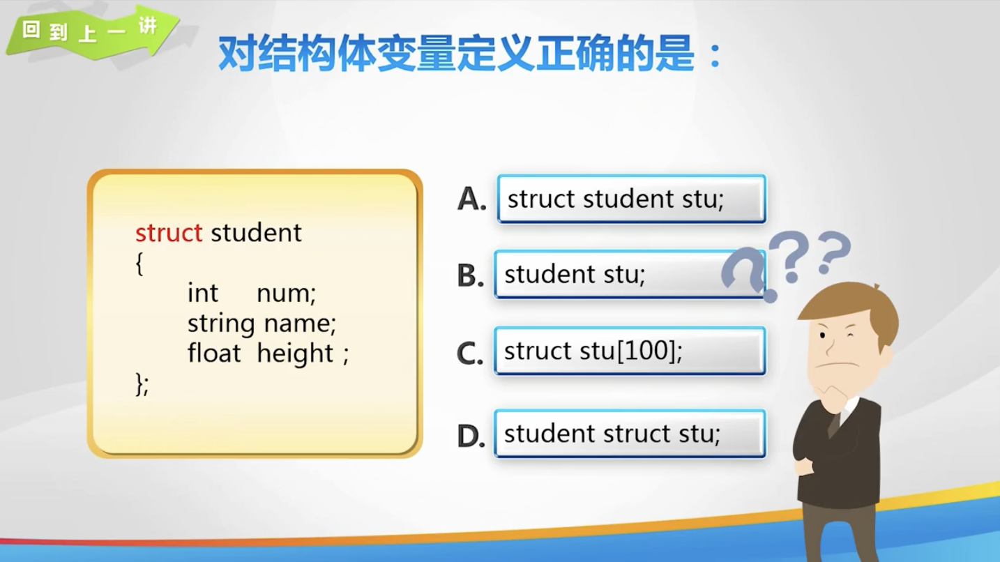

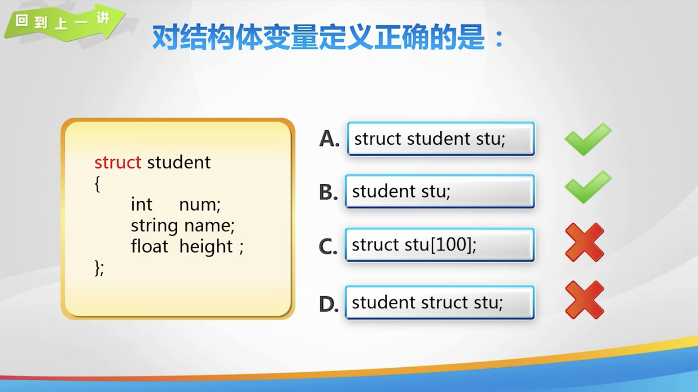

## 2. sort 函数

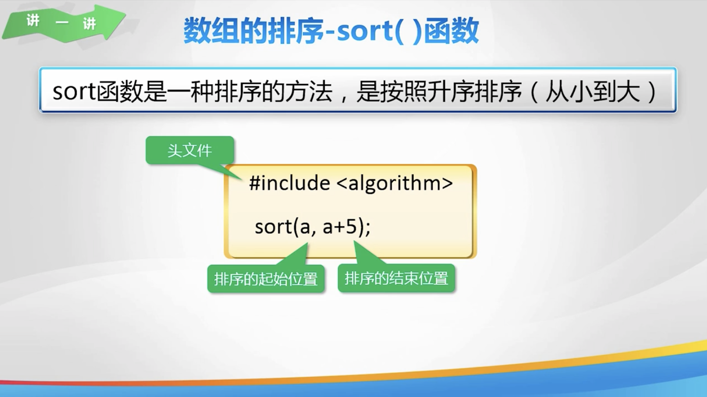

## 3. sort 函数进阶

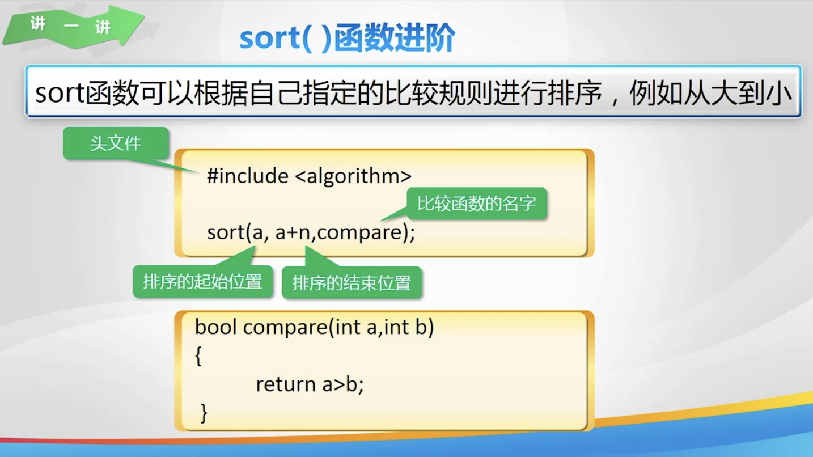

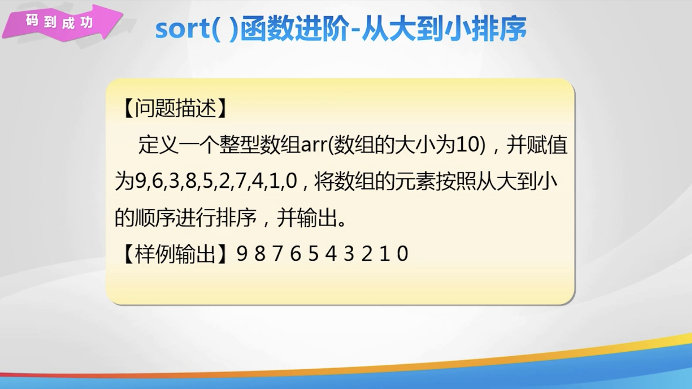

## 4. 结构体数组排序

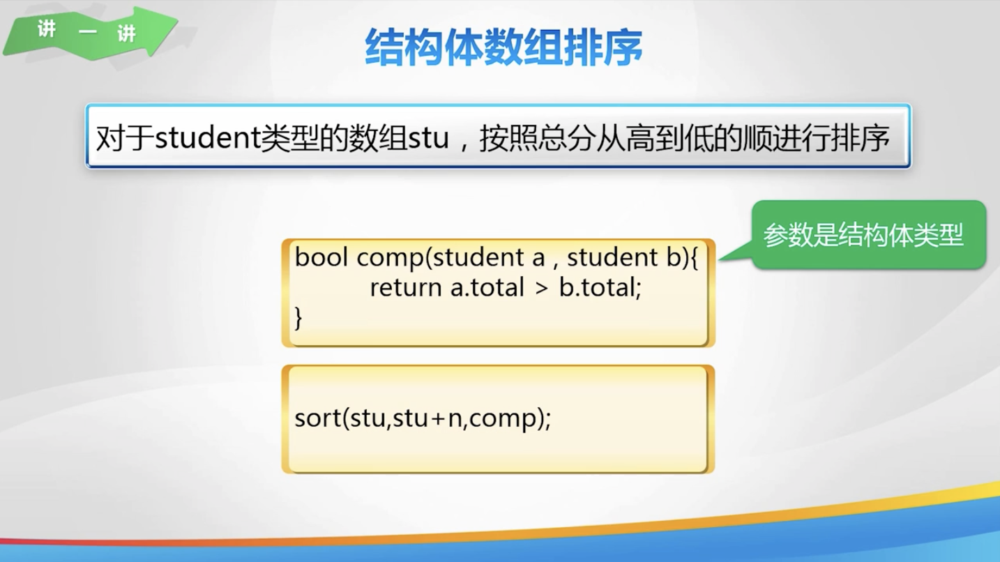

## 5. 练一练

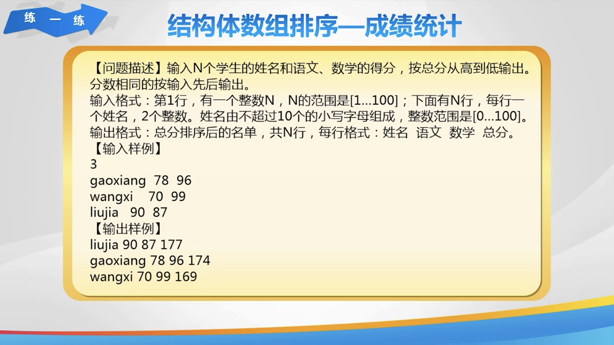

## 6. 数据排行

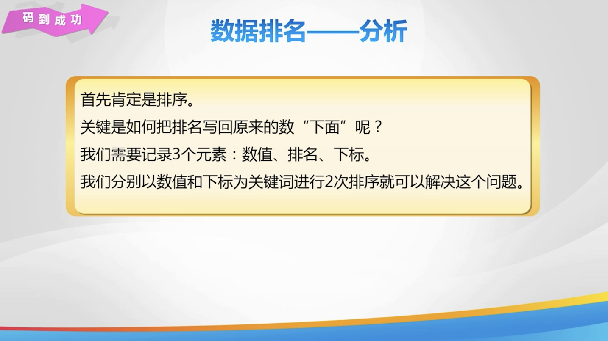

## 7. 欢乐秀一秀

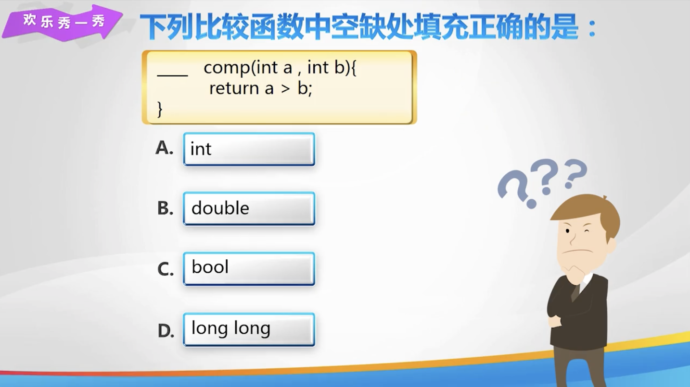

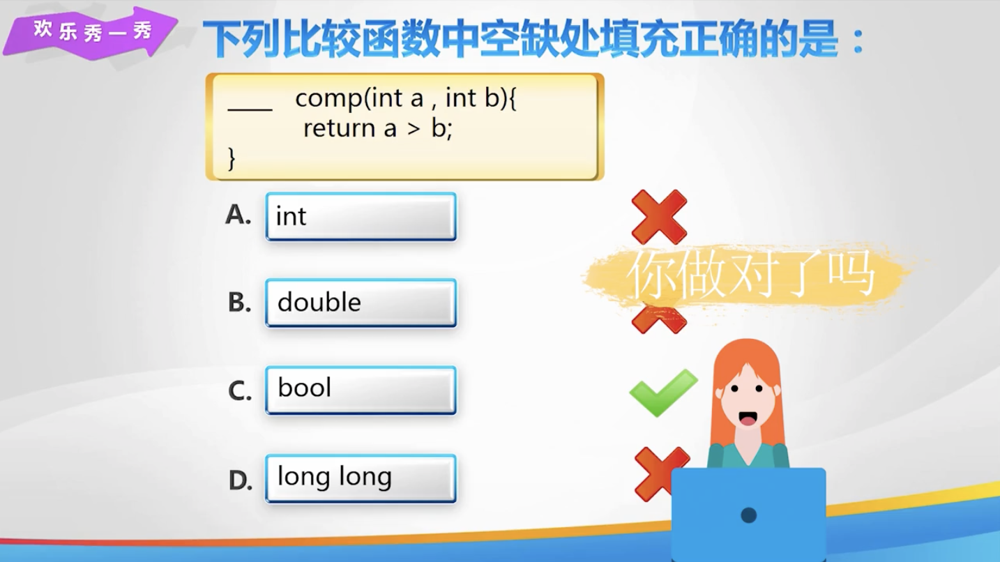

## 8. 总结


## 9. 亲自出码

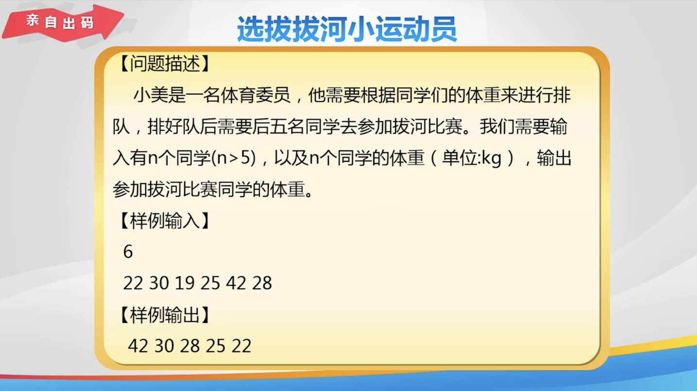

## 10. 代码

1. `sort 函数及进阶.cpp`

   ```cpp
   #include <iostream>
   #include <algorithm>
   
   using namespace std;
   
   bool compare(int a, int b) {
       return a > b;
   }
   
   int main() {
       int a[10] = {9, 6, 3, 8, 5, 2, 7, 4, 1, 0};
       sort(a, a + 10, compare);
       for (int i = 0; i < 10; i++) {
           cout << a[i] << ' ';
       }
       return 0;
   }
   ```

   

2. `结构体数组排序 - 成绩统计.cpp`

   ```cpp
   #include <iostream>
   #include <string>
   
   using namespace std;
   
   struct student {
       string name;
       int chinese, math;
       int total;
   
   };
   
   bool cmp(student a, student b) {
       return a.total > b.total;
   }
   
   student stu[101];
   
   int main() {
       int n;
       cin >> n;
       // 初始化学生信息
       for (int i = 0; i < n; i++) {
           cin >> stu[i].name >> stu[i].chinese >> stu[i].math;
           stu[i].total = stu[i].chinese + stu[i].math;
       }
       sort(stu, stu + n, cmp);
       for (int i = 0; i < n; i++) {
           cout << stu[i].name << ' ' << stu[i].chinese << ' ' << stu[i].math << ' ' << stu[i].total;
       }
       return 0;
   }
   ```

3. `数据排名 - 分析.cpp`

   ```cpp
   #include <iostream>
   #include <algorithm>
   using namespace std;
   
   struct node {
       int data;
       int rank;
       int index;
   };
   node a[10001];
   
   bool comp1(node x, node y) {
       return x.data < y.data;
   }
   
   bool comp2(node x, node y) {
       return x.index < y.index;
   }
   
   int main() {
       int n;
       cin >> n;
       for (int i = 1; i <= n; i++) {
           cin >> a[i].data;
           a[i].index = i;
       }
       sort(a + 1, a + n + 1, comp1);
      for (int i = 1; i<=n;i++) {
          a[i].rank = i;
      }
      sort(a + 1, a + n + 1, comp2);
      for (int i = 1; i <= n; i++) {
          cout << a[i].rank << ' ';
      }
       return 0;
   }
   ```

   

4. `选拔拔河小运动员.cpp`

   ```cpp
   #include <iostream>
   
   using namespace std;
   
   bool cmp(int a, int b) {
       return a > b;
   }
   
   // 选拔拔河小运动员
   int main() {
       int n, a[101] = {};
       cin >> n;
       for (int i = 0; i < n; i++) {
           cin >> a[i];
       }
       sort(a, a + n, cmp);
       for (int i = 0; i < 5; i++) {
           cout << a[i] << ' ';
       }
       return 0;
   }
   ```