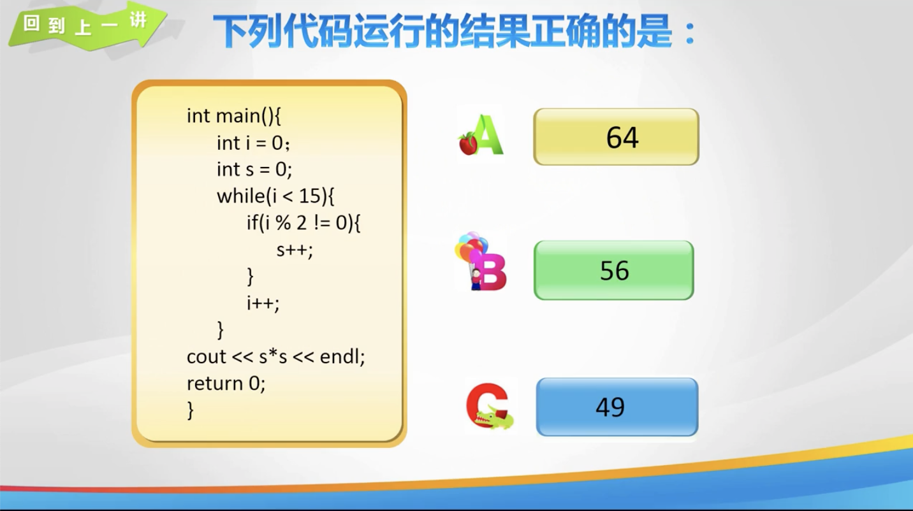
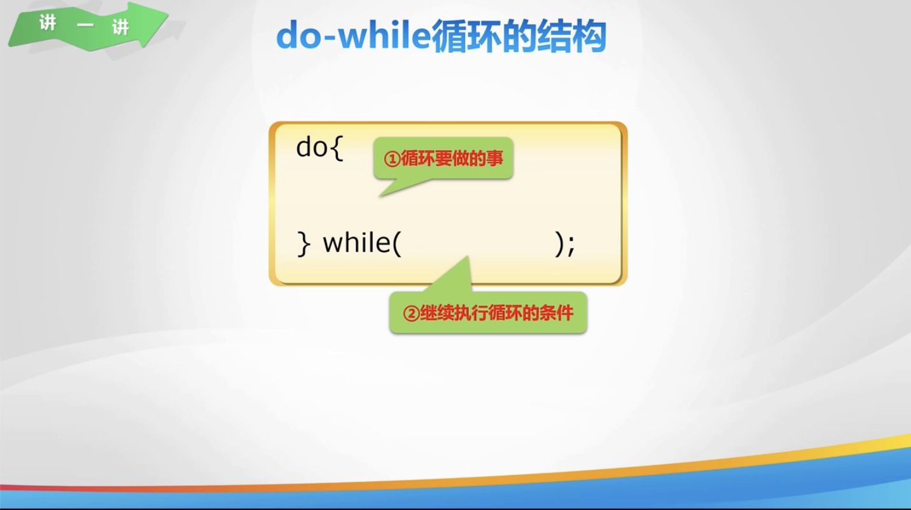
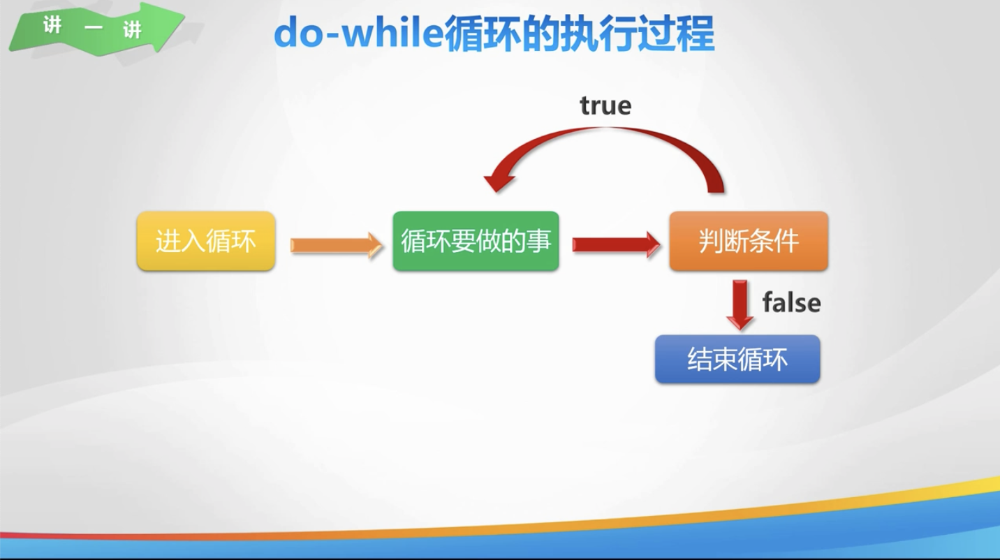
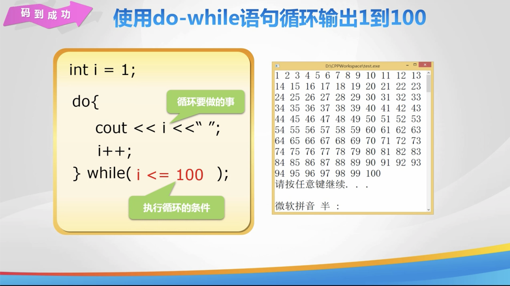
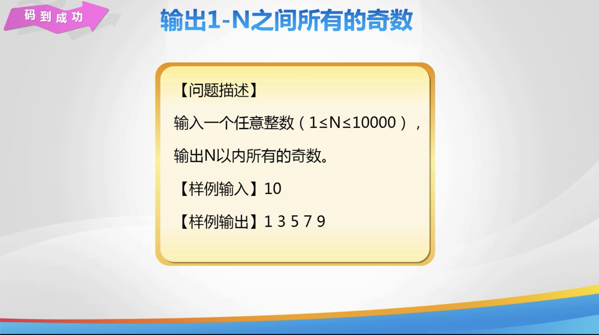
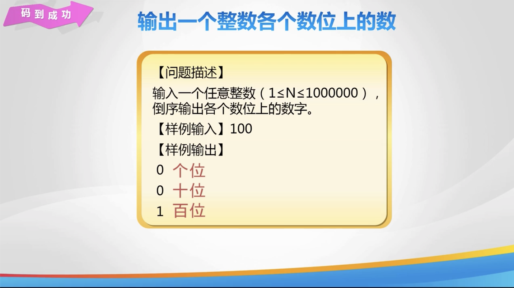
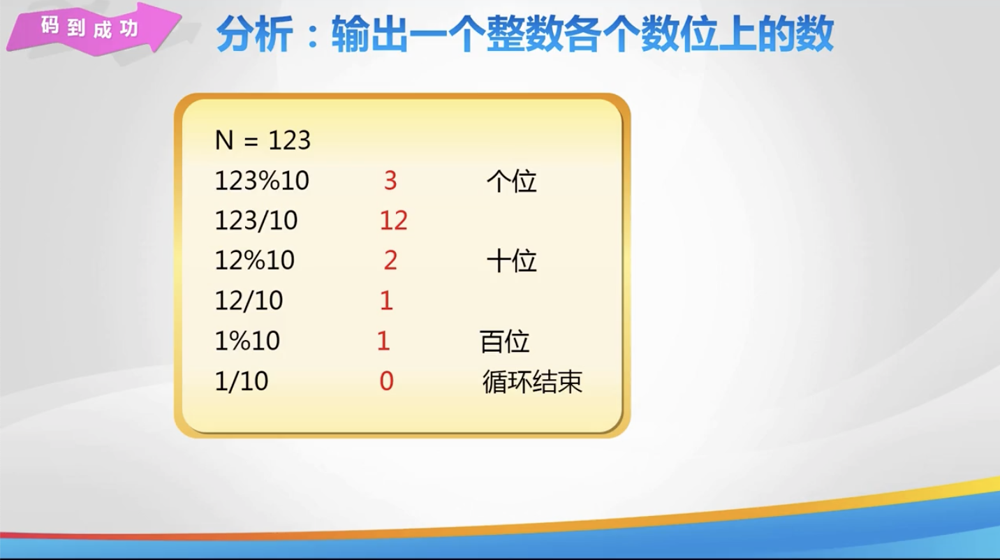
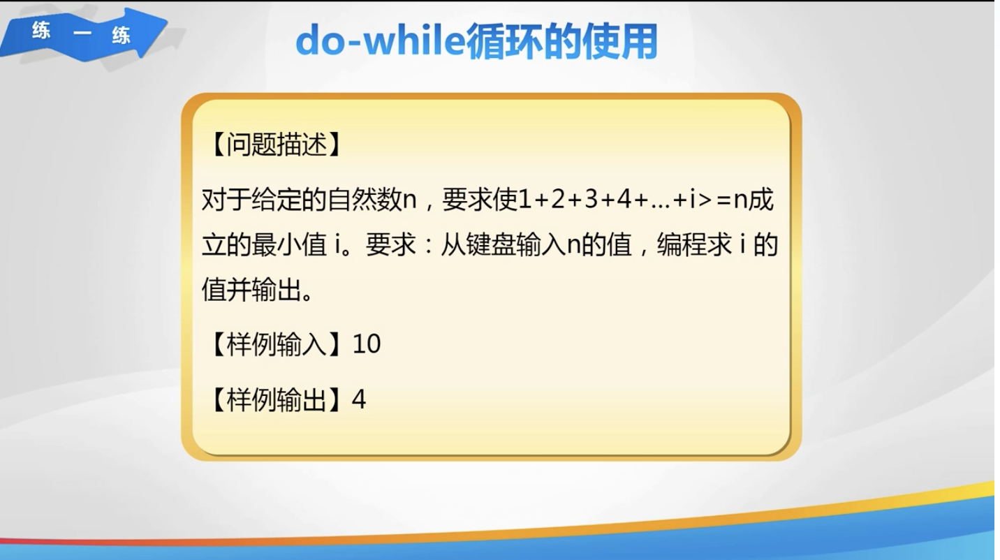
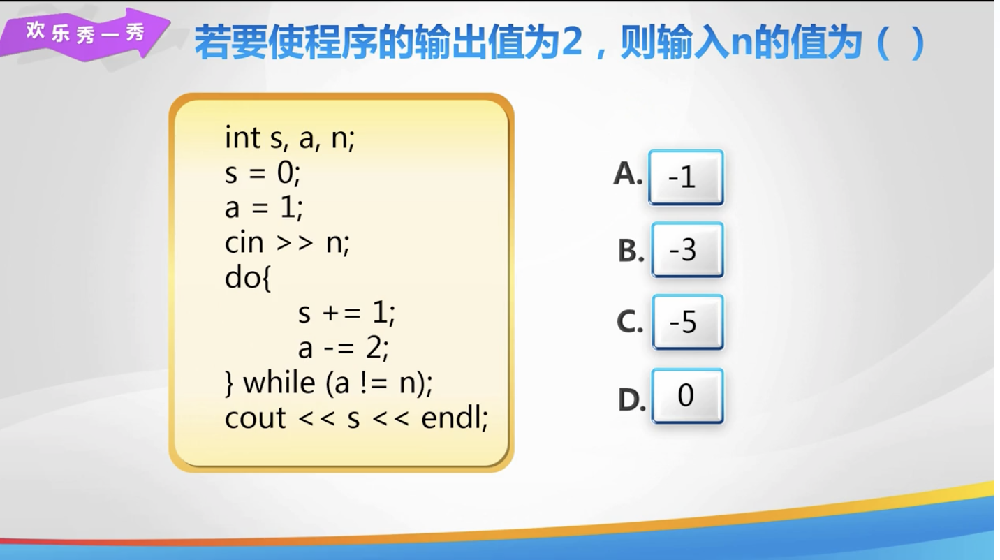
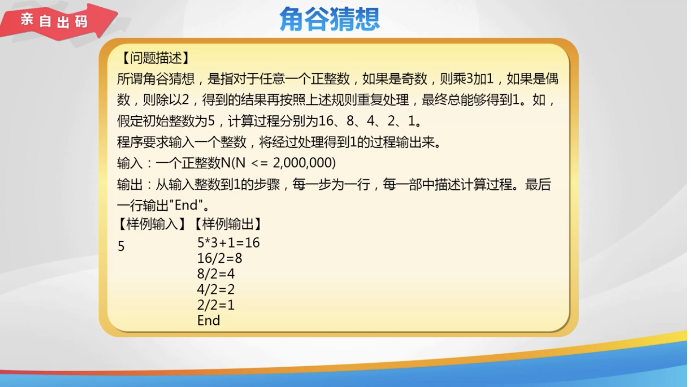

# Lesson 14

[toc]

## 1. 回到上一讲



## 2. while 循环







## 3. N 之间的奇数



## 4. 各个数位上的数





## 5. 练一练



## 6. 秀一秀



## 7. 总结


## 8. 亲自出码



## 9. 代码

1. `day14.cpp`

   ```c++
   #include <iostream>
   
   using namespace std;
   
   int main() {
       // 使用 do...while 循环输出 1-100
       // int i = 1;
       // do {
       //     // 循环要做的事情
       //     cout << i << " ";
       //     i++;
       // } while (i <= 100);
   
       // 输出 1-n 之间所有的奇数
       // int n, i = 1;
       // cin >> n;
       // do {
       //     // 循环要做的事
       //     // 判断是否是奇数
       //     if (i % 2 != 0) {
       //         cout << i << " ";
       //     }
       //     i++;
       // } while (i <= n);
   
       // 输出一个整数各个数位上得数
       // int n, a;
       // cin >> n;
       // do {
       //     // 循环要做的事
       //     // 不断获取最后一位
       //     a = n % 10;
       //     cout << a << endl;
       //     n /= 10;
       // } while (n != 0);
   
       // 要求满足 1 + 2 + 3 + ... + i >= n 的最小值i
       // int n;
       // int i = 1, sum = 0;
       // cin >> n;
       // do {
       //     // 循环累加
       //     sum = sum + i;
       //     i = i + 1;
       // } while (sum < n);
       // // 输出最小值i
       // cout << i - 1 << endl;
   
       // return 0;
   }
   ```

2. `亲自出码.cpp`

   ```c++
   #include <iostream>
   
   using namespace std;
   
   int main() {
       int n;
       cin >> n;
       do {
           // 重复做的事情
           if (n % 2 != 0) { // n 是奇数
               n = 3 * n + 1;
               cout << (n - 1) / 3 << "*3+1=" << n << endl;
           } else { // n 是偶数
               n = n / 2;
               cout << n * 2 << "/2=" << n << endl;
           }
       } while (n > 1);
       cout << "End" << endl;
       return 0;
   }
   ```

   